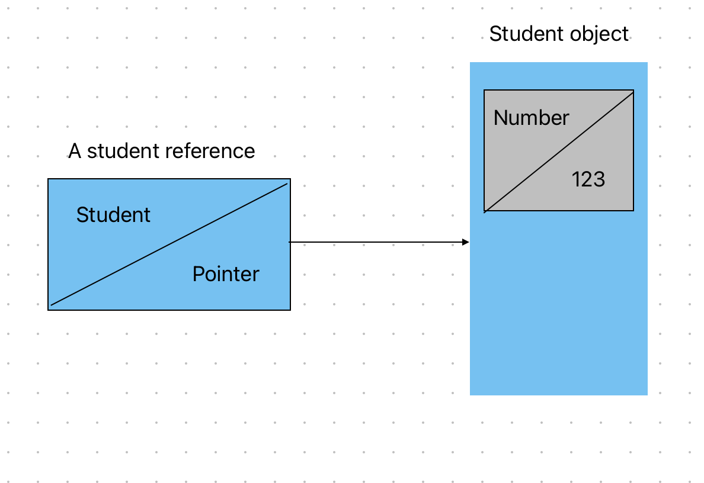

# My Summary and Notes of Java SE 11 Developer

# Chapter 1

## Components of Java

- `IDE`: software that provides comprehensive facilities for software development:
  - Editing source code
  - Syntax highlight
  - Auto-complete
  - Debugging

- Java Development Kit (`JDK`):

  - Contains minimum software you need to do development.
  - Key pieces:
    - [`javac`](#javac-program-generates-bytecode-file-class-that-the-java-command-can-run)
      - complier
      - turns source code to `bytecode(.class)`
    - [`java`](#java-launches-the-java-virtual-machine-jvm-before-running-the-code)
      - launcher
      - launches `JVM` and calls the code
    - archiver command: `jar`
      - Contains compressed format of ***complied*** java project
      - Has only `.class` files + meta data + other resources
      - Used for:
        - distributing java code/libraries for use by other resources
        - directly executing java program without `IDE`
    - API(application programming interfaces): reusable codes
    - `javadoc`: documentation generator
    - `JVM`: knows how to run bytecode on the machine it is on.
    - Java Runtime Environment (`JRE`)
      - The `JRE` was a subset of the `JDK`.
      - Can run a program but cannot compile one.
      - As of Java 11 it is depreciated.

- Flow:
  1. #### `javac`: program turns source code to bytecode file (`.class`) that the `java` command can run.
  2. #### `java`: launches the `JVM` before running the code.
  3. `JVM`: knows how to run bytecode (`.class`) on the actual machine it is on.

## Benefits of Java

- `Object Oriented`:
  - All code is defined in classes, and most of those classes can be instantiated into objects. (static classes are an exception)
  - Java allows for functional programming within a class
- `Encapsulation`: Java supports **access modifiers** to protect data from unintended access and modification.
- `Platform Independent`:
  - Java is both a compiled & interpreted language: source code compiles to bytecode, then JVM interpretes bytecode.
  - `“write once, run everywhere.”`: Java code gets compiled once rather than needing to be recompiled for different operating systems.
  - It is possible to write code that throws an exception in some environments
- `Robust`: prevents memory leaks by managing garbage collection automatically.
- `Simple`: no pointers, no operator overloading.
- `Secure`: Java code runs inside the `JVM`. This creates a sandbox that makes it hard for Java code to do evil things to the computer it is running on.
- `Multithreaded`
- `Backward Compatibility`: Most of the time, old programs will work with later versions of Java. Sometimes, changes that will break backward compatibility occur. Deprecation is a flag to indicate it shouldn’t be used.

## Java Class Structure

- `Classes`: basic building blocks.
- `Object`: is a runtime instance of a class in memory. An object is often referred to as an instance since it represents a single representation of the class.
- All the various objects of all the different classes represent the state of your program.

### Fields and Methods

- `methods/functions/procedures` **+** `fields/variables` **=** `members of class`
- ***Variables hold the state of the program, methods operate on that state***
- **keyword**: a word with special meaning
- `method name` **+** `parameter types` **=** `the method signature`
- The method declaration consists of additional information such as the return type

### Classes vs Files

- If you do have a public class, it needs to match the filename.
- ***Access modifiers***: `default`, `private`, `protected`, `public`
- `default` = declare a class without writing a access modifer for the class
- When there are multiple classes in a file, at most 1 of them can be `public`:

```java
// file name: Animal.java
public class Animal {
}
class Animal2 { // default
}
```

## Writing a `main()` Method

- A Java program begins execution with its `main()` method.
- `main()` method is the gateway between the startup of a Java process (managed by the `JVM`), and the beginning of the code. `JVM` calls on the underlying system to allocate memory and CPU time, access files, and so on
- The `main()` method lets the JVM call our code.
```java
public class Ege {
  public static void main(String[] args) {
    System.out.println(args[0]);
    System.out.println(args[1]);
  }
}
```
```shell
javac Ege.java     # The result is a file of bytecode by the same name, but with a .class filename extension
java Ege           # Notice that we must omit the .class extension to run Ege.java.
```
- `java` accepts the name of the class!!!
- To compile Java code: the file must have the extension .java and class name must match file name.
- `static` binds a method to its class so it can be called by just the class name. Java doesn’t need to create an object to call the `main()`
- If `main()` is not present, the process will throw an error and terminate.
- If `main()` is not static it will throw exception. Non-static `main()` is invisible for JVM.
- `main()` method’s parameter list:
  - an array of java.lang.String objects
  ```java
  String[] args
  String args[]   
  String... args  //  The characters ... are called varargs (variable argument lists).
  ```

### Passing Parameters to Java Program

```java
public class Ege {
  public static void main(String[] args) {
    System.out.println(args[0]);
    System.out.println(args[1]);
  }
}
```
```shell
javac Ege.java
java Ege Pipet "cok seviyorum" # use double quotes if you want to use a sentence

# output:
# Pipet
# cok seviyorum
```

- All command-line arguments are treated as String objects. Thus if you type 123 as an argument, it will compile and `args[0]` returns 123 since `args` is String array
- If you try `System.out.println(args[2]);` for this example, it will throw exception: `java.lang.ArrayIndexOutOfBoundsException`

### Running Code In One Line

```shell
java Ege.java Pipet "cok seviyorum"
```
- You can run a program without compiling it. 
- Java is still a compiled language, which means the code is being compiled in memory (Even if the code compiles properly, no `.class` file is created) and the java command can give you a compiler error.

Full | single-file source-code
--- | ---
Produces a `.class` file | Fully in memory 
For any program | For programs with one file
Can import code in any available Java library | Can only import code that came with the JDK


## Package Declarations and Imports
- **Packages**: logical groupings for classes
- `import`: tell Java which packages to look in for classes
- If a package begins with `java` or `javax`, this means it came with the JDK

### Wildcards
```java
import java.util.*; // imports all the classes in java.util.
```
- ***It doesn’t import child packages, fields, or methods; it imports only classes.***
- Importing all the classes with wildcard doesn't slow down program execution. Complier figures out which classes are needed.

### Redundant Imports
- `java.lang` automatically imported, thus can use `System` without import statement.

### Naming Conflicts
- ***Class names don’t have to be unique across all of Java: `java.util.Date` `java.sql.Date`***

```java
// When the class is found in multiple packages, Java gives you a compiler error
import java.util.*;
import java.sql.*; 

// it works. If you explicitly import a class name, it takes precedence over any wildcards present
import java.util.Date;
import java.sql.*;

// both have precendence: Java gives you a compiler error
import java.util.Date;
import java.sql.Date;

// if you really need to use both classes:
import java.util.Date;
public class Conflicts {
  Date date; // or java.util.Date date;
  java.sql.Date sqlDate;
}
```

### Compiling and Running Code With Package
<details>
<summary>Details...</summary>
<br>

```java
package packagea;
public class ClassA {
}
//--------------------------------
package packageb;
import packagea.ClassA;
public class ClassB {
  public static void main(String[] args) {
    ClassA a;
    System.out.println("Got it");
  }
}
```
1. Go to C:\temp
2. Compile `javac packagea/ClassA.java packageb/ClassB.java` or `javac packagea/*.java packageb/*.java` (if you want all the classes to be compiled under packagea and packageb)
3. 2 files created: `packagea/ClassA.class` and `packageb/ClassB.class`
4. Run `java packageb.ClassB`

- `javac` places the compiled classes in the same directory as the source code
- The `-d` option specifies this target directory:
```shell
javac -d classes packagea/ClassA.java packageb/ClassB.java
```
- Packages created in these directories: `classes/packagea/ClassA.class` and `classes/packageb/ClassB.class`
- To run the program, you specify the classpath:
```shell
java -cp classes packageb.ClassB
java -classpath classes packageb.ClassB
java --class-path classes packageb.ClassB
```
- You can't use `-d` for `java` command
- You can use classpath commands for both `java` and `javac`

### Compling With JAR File
```shell
java -cp ".;C:\temp\someOtherLocation;c:\temp\myJar.jar" myPackage.MyClass     # semi colon used to seperate: look for packages in current directory
                                                                               # and someOtherLocation and within myJar.jar

java -cp "C:\temp\directoryWithJars\*" myPackage.MyClass                       # match all the JARs in directory, excluding subdirectories
```

### Creating JAR File
```shell
jar -cvf myNewFile.jar                        # -c = --create, -v = --verbose, -f = --file, 
jar --create --verbose --file myNewFile.jar

jar -cvf myNewFile.jar -C dir                 # specify directory
```

### `javac` `java` `jar`
Option | `javac` | `java` | `jar`
--- | --- | --- | ---
`-cp` `-classpath` `--class-path` | X | X | X
`-d` | X | - | -
`-c` | - | - | X
`-C` | - | - | X
`-v` | - | - | X
`-f` | - | - | X

</details>

## Ordering Elements In Class

Element | Required? | Location
--- | --- | ---
Package declaration | No | First line of file
Import | No | immediately after package declaration
Class declaration | Yes | After import
Field declarations | No | inside class
Method declarations | No | inside class
Comments | No | Can go anywhere even in first line of file

## Code Formating In Exam
<details>
<summary>Details...</summary>
<br>

Don't need to check for imports if:
- Code that begins with a class name
- Code that begins with a method declaration
- Code that begins with a code snippet that would normally be inside a class or method,
- Code that has line numbers that don’t begin with 1
</details>

## Bonus:

```java
// INSERT PACKAGE NAME HERE
public class Bird { }
```
- Bird is in `/my/directory/named/A/Bird.java`
- The package name represents any folders underneath the current path
- Thus `package my.directory.named.A;` wont work
- Correct one is `package named.A;`


___
 

# Chapter 2: Java Building Blocks

## Creating Objects
```java
public class Chick {
  public Chick() {
    System.out.println("in constructor");
  }
}
```
***Key points of constructor:***
  - the name of the constructor matches the name of the class
  - there’s no return type.

### Instance Initializer Blocks (IIB)

- `Code block`: the code between `{}`
- `Instance initializer block`: when the code block is out of a method

### Order of Initialization

- ***Fields and instance initializer blocks run in the order they appear***
- ***Constructor runs after fields and IIB***
- ***Order matters for the fields and blocks of code. You can’t refer to a variable before it has been defined***


## Understanding Data Types

### Primitive types: 8 built-in data types

Keyword | Type | Example
--- | --- | ---
`boolean` | true/false | true
`byte` | 8bit integral | 123
`short` | 16bit integral | 123
`int` | 32bit integral | 123
`long` | 64bit integral | 123L
`float` | 32bit floating-point | 123.45f
`double` | 64bit floating-point | 123.456
`char` | 16bit unicode | 'a'

- String is not primitive even though there is built-in support. It is an object.
- `byte` can hold between -128 to 127
- `short` and `char` are closely related: 
  - `short` is signed, `char` is unsigned; thus `char` has higher range for positive integer
  - you can use them interchangeably in some cases
  ```java
  short bird = 'd';
  char mammal = (short)83;

  System.out.println(bird); // Prints 100
  System.out.println(mammal); // Prints S

  short reptile = 65535; // DNC: 65535 is int but out of range for short. Need to use explicit cast: (short)65535
  char fish = (short)-1; // DNC: char is unsigned
  ```

### Literals
- When a number is present in the code, it is called a literal.

```java
long max = 3123456789; // DNC: because 3123456789 is seen as int, however this is bigger than Integer.MAX_VALUE
long max = 3123456789L; // now Java knows it is a long
```

- Underscore
  - You can not put `_` at the beginning/end of literal and right before/after decimal point
  ```java
  double notAtStart = _1000.00; // DOES NOT COMPILE
  double notAtEnd = 1000.00_; // DOES NOT COMPILE
  double notByDecimal = 1000_.00; // DOES NOT COMPILE
  double annoyingButLegal = 1_00_0.0_0; // compiles
  double reallyUgly = 1__________2; // Also compiles
  ```

### Reference Types
- A reference type refers to an object (an instance of a class)
- Primitive types hold their values in the memory where variable is allocated
- Reference types point to an object by storing the object's memory adress

  

- A reference can be assigned to another object of the same or compatible type.

### Primitive VS Reference Types
- Primitive types can not be null
  ```java
  int value = null; // DOES NOT COMPILE
  String s = null;
  ```
- Reference types can be used to call methods (if reference is not null)
  ```java
  String reference = "hello";
  int len = reference.length();
  int bad = len.length(); // DOES NOT COMPILE
  ```

## Declaring Variables

### Identifiers
- An identifier is the name of a variable, method, class, interface, or package
- 4 rules for legal identifiers:
  1. Must begin with a `letter` or `$` or `_`
  2. Can include numbers but cannot start with them
  3. `_` is not allowed as identifier
  4. Cannot use java's reserved words (`abstract`, `case`, `continue`, `const`, `goto`, `true`...)

### Declaring Multiple Variables
- ***You can declare many variables in the same declaration as long as they are all of the same type.*** 
- ***You can also initialize any or all of those values inline.***
```java
void sandFence() {
 String s1, s2;
 String s3 = "yes", s4 = "no";

 int num, String value; // DNC
}
```

## Initializing Variables

### Initiliazing Local Variables
- A local variable is a variable defined within a constructor, method, or initializer block
- Local variables do not have a default value and must be initialized before use. 
- Complier will report error if you use an uninitialized variable.

### Passing Constructor and Method Paramters
- Variables passed to a constructor or method are called ***constructor parameters or method parameters***
- They are like local variables that have been initialized before the method is called, by the caller.
```java
public void findAnswer(boolean check) {}

public void checkAnswer() {
 boolean value;
 findAnswer(value); // DNC: value is not initialized
}
```

### Defining Instance and Class Variables
- An `instance variable`/`field`, is a value defined within a specific instance of an object
- A `class variable`:
  - it has the keyword `static` before it
  - defined on the class level / ***shared among all instances of the class***.
- ***Instance and class variables*** do not require you to initialize them. As soon as you declare these variables, they are given a default value:
  Variable Type | Default Initialization Value
  --- | --- 
  `boolean` | `false`
  `byte`, `short`, `int`, `long` | 0
  `float`, `double` | 0.0
  `char` | '\u0000' (NUL)
  All object references | `null`

### Introducing `var`
- ***Can use `var` instead of the primitive or reference type***
- ***`var` is a specific type defined at compile time. It does not change type at runtime.***
- The formal name of this feature is **local variable type inference**:
  1. ***Thus can be used only as local variable***
    ```java
    public class VarKeyword {
      var tricky = "Hello"; // DNC: this is an instance variable
    }
    ```

  2. ***Instructing the compiler to determine the type for you***
    ```java
    public void reassignment() {
      var number = 7;
      number = 4;
      number = "five"; // DNC
    }

    var apples = (short)10;
    apples = (byte)5;   // value stored in apples is still short 
                        // but in here byte is automatically promoted to short
    apples = 1_000_000; // DNC: beyond the limits of short
    ```

- ***Initialization has to be done in the same line as declaration for `var`, otherwise code does not compile:***
```java
public void reassignment() {
  var question; // DNC
  question = 1;
}
```

- ***Java does not allow `var` in multiple variable declarations.***

- While a `var` cannot be initialized with a null value without a type, it can be assigned a null value after it is declared (provided that the underlying data type of the `var` is an object)
- `var` can be initialized to a null value if the type is specified
```java
var n = null; // DNC: cannot be initialized to null

var n = "myData";
n = null;

var m = 4;
m = null; // DNC: int cannot be null

var o = (String)null; // var can be initialized to a null value if the type is specified
```

### Bonus
```java
public int addition(var a, var b) { // DNC: var can be used only for local variables
                                    // a and b are method parameters
 return a + b;
}
```
```java
package var;

public class Var { // because of case sensitivity this is allowed
  public void var() { // Naming a method var is legal: var is not a reserved word
    var var = "var"; // Naming a local variable var is legal: var is not a reserved word
  }
  public void Var() {
    Var var = new Var(); // Naming a local variable var is legal: var is not a reserved word 
  }
}
```

- While `var` is not a reserved word and allowed to be used as an identifier, it is considered a `reserved type name`.
- A `reserved type name` means it cannot be used to define a type, such as a class, interface, or enum
```java
public class var { // DNC
  public var() {
  }
}
```

## Managing Variable Scope
- **Local variables**: In scope from declaration to end of block
- **Instance variables**: In scope from declaration until object eligible for garbage collection
- **Class variables**: In scope from declaration until program ends 

## Destroying Objects
- All Java objects are stored in your program memory’s heap.
- ***Garbage collection***: Refers to the process of automatically freeing memory on the heap by deleting objects that are eligible for garbage collection
- ***eligible for garbage collection***: Refers to an object’s state of no longer being accessible in a program.
- ***Eligible for garbage collection doesn't mean the object will be immediately garbage collected.***

### Calling `System.gc()`
- What is the `System.gc()` command guaranteed to do? Nothing, actually. It merely suggests that the JVM kick off garbage collection. Nothing is guaranteed.
- JVM can ignore this request. `System.gc()` is not guaranteed to run or do anything. 
- Program may still run out of memory even if `System.gc()` is called

### Tracing Eligibility
- An object is no longer reachable when one of two situations occurs:
  1. The object no longer has any references pointing to it.
  2. All references to the object have gone out of scope.

## Objects VS References
- ***All references are the same size, no matter their object type***
- ***Object sits in heap and doesn't have a name***
- ***The object is garbage is collected but reference is not garbage collected***

___

# Chapter 3

## Operator Precedence
- If two operators have the same level of precedence, then Java guarantees left-to-right evaluation.

Operator | Example
-- | --
Post-unary operators | a++
Pre-unary operators | ++a
Other unary operators | -, !, ~, +, (type)
Multiplication / division / modulus  | *, /, %
Addition/subtraction | +,-
Shift operators | <<, >>, >>>
Relational operators | <, >, <=, >=, instanceof
Equal to/not equal to | =, !=
Logical operators | &,^,|
Short-circuit logical operators | &&,||
Ternary operators | a ? b : c
Assignment operators | =, +=, -=, *=, /=, %=, &=, ^=, |=, <<=, >>=, >>>=

## Unary Operators
- Needs only 1 variable
- ! (negate boolean), + (positive number) , - (negative number or negates an expression), ++ (increments by 1), -- (decrements by 1), (type) (cast a value to a type)
- in Java, 1 and true are not related in any way, just as 0 and false are not related

## Increment and Decrement
- **Pre (`++val;`)**: If the operator is placed before the operand, then the operator is applied first and the value returned is the new value of the expression. 
- **Post (`val++;`)**: If the operator is placed after the operand, then the original value of the expression is returned, with operator applied after the value is returned.
- Example:
```java
int lion = 3;
int tiger = ++lion * 5 / lion--;
```
  1. int tiger = ++lion * 5 / 3     // 3 is returned, then lion decremented to 2
  2. int tiger = 3 * 5 / 3          // lion is incremented to 3, then lion return 3
  3. tiger is 5
  4. Lion is 3

## Binary Arithmetic Operators
- `+,-,%,/,*`
- For integer values, division results in the floor value of the nearest integer that fulfills the operation
- Floor value: discard anything after decimal: 4.645634 --> 4
- Modulus can work with negative numbers

## Numeric Promotions
1. If two values have different data types, Java will automatically promote one of the values to the larger of the two data types.
2. If one of the values is integral and the other is floating-point, Java will automatically promote the integral value to the floating-point value’s data type.
3. Smaller data types: `byte`, `short`, and `char` are first promoted to int any time they’re used with a Java binary arithmetic operator, even if neither of the operands is int.
    - Unary operators are excluded from this rule
4. After all promotion has occurred and the operands have the same data type, the resulting value will have the same data type as its promoted operands.

```java
int x = 1;
long y = 33;
var z = x * y; // z is long

double x = 39.21;
float y = 2.1; // does not compile since 2.1 will be treated as double, but double cannot be promoted down to short
var z = x + y;

short x = 10;
short y = 3;
var z = x * y; // z is integer: x and y are both promoted to int before multiplication!


short w = 14; 
float x = 13; 
double y = 30;
// w is promoted to int to be used in binary arithmetic operation, 
//then w is promoted to float so w can be multiplied with x 
// result of w * x then promoted to double so it can be divided with y
var z = w * x / y; 
```

## Assignment Operator
- Java will automatically promote from smaller to larger data types
- But it will throw a compiler exception if it detects that you are trying to convert from larger to smaller data types without casting
- Result of an assignment is an expression in and of itself, equal to the value of the assignment.
```java
long wolf = 5;
long coyote = (wolf=3);     // set wolf to 3, then return it
System.out.println(wolf);   // 3
System.out.println(coyote); // 3

boolean healthy = false;
if(healthy = true)          // healthy is assigned to true, then true is returned
   System.out.print("Good!"); // prints Good!
```

## Casting Values
- Optional if the casting is from bigger to smaller type
- Mandatory if casting is from smaller to bigger type
```java
int fur = (int)5;
int hair = (short) 2;
String type = (String)     "Bird";
short tail = (short)(4 + 10);
long feathers = 10(long); // DOES NOT COMPILE: unary operator(cast) is in wrong side

float egg = 2.0 / 9;        // DOES NOT COMPILE
int tadpole = (int)5 * 2L;  // DOES NOT COMPILE
short frog = 3 - 2.0;       // DOES NOT COMPILE

short mouse = 10;
short hamster = 3;
short capybara = mouse * hamster;  // DOES NOT COMPILE
short capybara = (short)(mouse * hamster);

short capybara = (short)mouse * hamster;      // DOES NOT COMPILE: mouse and hamster promoted to int
short gerbil = 1 + (short)(mouse * hamster);  // DOES NOT COMPILE: result is automatically casted to int
```

## Compound Assignment Values
- `+=, -=, /=, *=`
- Compound assignments automatically casts variables!!
```java
long goat = 10;
int sheep = 5;
sheep = sheep * goat;   // DOES NOT COMPILE
sheep *= goat;          // COMPILES: sheep is casted to long, then result casted to int
```

## Overflow and Underflow
```java
short ticketTaker = (short)1921222;  // Stored as 20678
System.out.print(2147483647+1);  // -2147483648
```

## Equality Operators
Equality | Primitive | Objects
-- | -- | --
`==` | two values represent same value | two values reference the same object
`!=` | two values represent different value | two values **do not** reference the same object

- Only 3 scenarios are allowed:
  1. Comparing two numeric types or primitives: If the numeric values are of different data types, the values are automatically promoted.
  ```java
  5 == 5.00 // true
  ```
  2. two booleans
  3. Two objects

  ```java
  boolean monkey = true == 3;       // DOES NOT COMPILE
  boolean ape = false != "Grape";   // DOES NOT COMPILE
  boolean gorilla = 10.2 == "Koko"; // DOES NOT COMPILE
  ```
- Two references are equal if and only if they point to the same object or both point to null
```java
File monday = new File("schedule.txt");
File tuesday = new File("schedule.txt");
File wednesday = tuesday;
System.out.println(monday == tuesday);    // false: same file content but don't point to same object
System.out.println(tuesday == wednesday); // true
```

## Relational Operators
- `<,>,<=,>=`: applies only to numeric values
- `a instanceof b`: Returns true if the reference that `a` points to is an instance of a class, subclass or class that implements a particular interface, as named in `b`
- If the two numeric operands are not of the same data type, the smaller one is promoted
```java
public static void openZoo(Number time) {
   if(time instanceof String) // DOES NOT COMPILE: String and Number are incompatible, only applies to classes, not interfaces
```
- using null with `instanceof` always results in `false`
```java
System.out.print(null instanceof Object); //false
System.out.print(null instanceof null);  // DOES NOT COMPILE
```

## Logical Operators
- `&, |, ^`: can be used for boolean and numeric types. If used for numeric types: ***bitwise operators***

## Short-Circuit Operators
- `&&, ||`
- Good for avoiding `NullPointerException`:
```java
if(duck!=null & duck.getAge()<5) { // Could throw a NullPointerException
if(duck!=null && duck.getAge()<5) { // Doesn't throw NullPointerException

int rabbit = 6;
boolean bunny = (rabbit >= 6) || (++rabbit <= 7);  // rabbit won't be incremented since short-circuit
System.out.println(rabbit);                        // prints 6
```
- there is no requirement that second and third expressions in ternary operations have the same data types
```java
int stripes = 7;
System.out.print((stripes > 5) ? 21 : "Zebra");
int animal = (stripes < 9) ? 3 : "Horse";  // DOES NOT COMPILE
```

___

# Chapter 4

## `if-else`

## `switch`
- a switch statement must have braces around the variable
- a switch statement must have curly braces around the switch body
- `case`, `defult`, `break` are optional
- `default`: it is branched to only if there is no matching case value for the switch statement, regardless of its position within the switch statement
- A switch can have 0 `case`
- Allowed types: 
  - `int` and `Integer`
  - `byte` and `Byte`
  - `short` and `Short`
  - `char` and `Character`
  - `String`
  - `enum` values
  - `var` (if the type resolves to one of the preceding types)

```java
int month = 5;
// a switch statement must have braces around the variable
switch (month) {                  // a switch statement must have curly braces around the switch body
  case 1:                         // "case" keyword then value then ":"
    System.out.print("January");
    break;                        // optional
  case 1 | 2:
    break;
  default:                        // optional
    System.out.print("April");

switch(month){}
}
```
- In the example below, the code will jump to the default block and then execute all of the proceeding case statements in order until it finds a break statement or finishes the switch statement
```java
var dayOfWeek = 5;
switch(dayOfWeek) {
 case 0:
  System.out.println("Sunday");
 default:
  System.out.println("Weekday");
 case 6:
  System.out.println("Saturday");
  break;
}

//output:
Weekday
Saturday

// if dayOfWeek = 6, Output:
Saturday // default is branched only if there is no match

// if dayOf Week =0, Output:
Sunday
Weekday   //  default statement is executed since there was no break statement in first case
Saturday
```

### Acceptable Case Values
- the values in each `case` statement must be ***compile time constant values*** of the same data type as the `switch` value
- ***Compile time constants***: `enum`, `final`, literals
-  data type for `case` statements must all match the data type of the `switch` variable
```java
final int getCookies() { return 4; }

void feedAnimals(final int x) {
 final int bananas = 1;
 int apples = 2;
 int numberOfAnimals = 3;
 final int cookies = getCookies();
 switch (numberOfAnimals) {
  case bananas:
  case apples: // DOES NOT COMPILE: not final
  case getCookies(): // DOES NOT COMPILE: evaluated at runtime
  case cookies : // DOES NOT COMPILE: evaluated at runtime
  case 3 * 5 :
  case x: // DOES NOT COMPILE: x is final but it is not constant since it is passed to the function
 }
}
```

### Numeric Promotion and Casting
- Last but not least, switch statements support numeric promotion that does not require an explicit cast.
```java
short size = 4;
final int small = 15;
final int big = 1_000_000;
switch(size) {
 case small: // 15 is small enough to cast from int to short
 case 1+2 :
 case big: // DOES NOT COMPILE: cannot auto cast from long to short
}
```

## `while`

## `do-while`

## `for`
```java
for(initialization; boolExpression: updateStatement){}
```
Order:
1. init
2. boolExpression
3. body
4. updateStatement
5. return to 2

- `var` is allowed
- initialization and update sections may contain multiple statements, separated by commas

### Working with `for` loops
1. Infinite loop
```java
for( ; ; )
```
2. Multiple terms in `for``
```java
int x = 0;
for(long y = 0, z = 4; x < 5 && y < 10; x++, y++) {
 System.out.print(y + " "); }
System.out.print(x + " ");

// output:
1 2 3 4 5 // 5 is outside of loop
```
3. Redeclaring a Variable in the Initialization Block
```java
int x = 0;
for(int x = 4; x < 5; x++) { // DOES NOT COMPILE
 System.out.print(x + " ");
}

for(x = 0; x < 5; x++) {
 System.out.print(x + " ");
}
```
4. Using Incompatible Data Types in the Initialization Block
  - The variables in the initialization block must all be of the same type
```java
int x = 0;
for(long y = 0, int z = 4; x < 5; x++) { // DOES NOT COMPILE
 System.out.print(y + " ");
}
```

### Modifying Loop Variables
```java
for(int i=0; i<10; i++)
 i = 0;
for(int j=1; j<10; j++)
 j--;
for(int k=0; k<10; )
 k++;
``` 

## `foreach`
- The right side of the for-each loop must be one of the following: 
  - A built-in Java array
  - An object whose type implements java.lang.Iterable
- The left side of the for-each loop must include a declaration for an instance of a variable whose type is compatible with the type of the array or collection on the right side of the statement
- `var` is allowed at the left side
-  Java actually converts the for-each loop into a standard for loop during compilation
```java
for(int value : values) {
 System.out.print(value + ", ");
}
// if value implemets Iterable
for(Iterator<Integer> i = values.iterator();i.hasNext(); ) {  // there is no update statement !!!
 int value = i.next();
 System.out.print(value + ", ");
}
//if value is not iterable
for(int i=0; i < values.length; i++) {
 String value = values[i];
 System.out.print(value + ", ");
}
```

## Optional Labels
- `if`, `switch` and loops may have ***optional labels***
- A label is an optional pointer to the head of a statement that allows the application flow to jump to it or break from it.
```java
INNER_LOOP: for(int i=0; i<mySimpleArray.length; i++)
{
 System.out.print(mySimpleArray[i]+"\t");
 }
```

## `break`
- Without a label parameter, the `break` statement will terminate the nearest inner loop it is currently in the process of executing
- `break`break statement can take an optional label parameter.
- `return` can be also used to exit loops quickly

## `continue`
- causes flow to finish the execution of the current loop
- `continue` is applied to the nearest inner loop under execution using optional label statements to override this behavior.

## `Unreachable Code`
- Any code placed after `break`, `return`, `continue` in the same code block is unreachable and will not compile

___

# Chapter 5

## Creating and Manipulating `String`
- `String` does not need `new` to be instantiated
- `String` is a sequence of `char` and implements `CharSequence`

## Concatenation
- If either operand is `String` then it is concatenation
- Concatenation is evaluated from left to right
```java
System.out.println(1 + 2); // 3
System.out.println("a" + "b"); // ab
System.out.println("a" + "b" + 3); // ab3
System.out.println(1 + 2 + "c"); // 3c
System.out.println("c" + 1 + 2); // c12
```

## Immutability
- Once a `String`object is created it can not be changed
- **Why?:** immutablity creates a perfectly full box (optimization), but the downfall is zero flexibility
- Immutable classes in Java are `final`, which prevents subclasses creation. You wouldn’t want a subclass adding mutable behavior.
```java
String s1 = "1";
String s2 = s1.concat("2");
s2.concat("3");
System.out.println(s2); // prints 12
```

## Important `String` Methods
```java
int length()

char charAt(int index)

// return -1 if no match is found
int indexOf(int ch)                            // char can be also passed
int indexOf(int ch, int fromIndex)             // char can be also passed
int indexOf(String str)
int indexOf(String str, int fromIndex)

String substring(int beginIndex)
String substring(int beginIndex, int endIndex)  // endIndex is not inclusive
System.out.println(string.substring(3, 3)); // empty string
System.out.println(string.substring(3, 2)); // throws exception
System.out.println(string.substring(3, 8)); // throws exception: assume last index is 7

String toLowerCase()
String toUpperCase()

boolean equals(Object obj)
boolean equalsIgnoreCase(String str)

boolean startsWith(String prefix)
boolean endsWith(String suffix)

String replace(char oldChar, char newChar)
String replace(CharSequence target, CharSequence replacement)

boolean contains(CharSequence charSeq)

String strip()            //remove whitespace from the beginning and end
String stripLeading()     //removes whitespace from the beginning
String stripTrailing()    //
String trim()             //remove whitespace from the beginning and end

String intern()     // returns the value from the string pool if it is there, otherwise add to string pool
```

## `StringBuilder`
- Mutable, it changes it's inner state
```java
StringBuilder a = new StringBuilder("abc"); // a references to "abc"
// a references to "abcde"
StringBuilder b = a.append("de");           // a and b reference to "abcde"
// a and b references to "abcdefg"
b = b.append("f").append("g");              // assigment operation doesn't actually do anything since b is already referencing to the object          
System.out.println("a=" + a);               // "abcdefg"
System.out.println("b=" + b);               // "abcdefg"
```

## `StringBuilder` Constructors
```java
StringBuilder sb1 = new StringBuilder();
StringBuilder sb2 = new StringBuilder("animal");  // create it with specific value
StringBuilder sb3 = new StringBuilder(10);        // max char slot is 10
```

## `StringBuilder` Methods
```java
int length()

char charAt(int index)

// return -1 if no match is found
int indexOf(int ch)                            // char can be also passed
int indexOf(int ch, int fromIndex)             // char can be also passed
int indexOf(String str)
int indexOf(String str, int fromIndex)

String substring(int beginIndex)
String substring(int beginIndex, int endIndex)

StringBuilder append(String str)

StringBuilder insert(int offset, String str)

StringBuilder delete(int startIndex, int endIndex)  // endIndex is allowed exceed the end of the StringBuilder, in that case Java assumes endIndex=length-1
StringBuilder deleteCharAt(int index)

StringBuilder replace(int startIndex, int endIndex, String newString)   // java deletes from startIndex to endIndex(not inclusive, can exceed length), java puts newString to startIndex

StringBuilder reverse()

String toString()
```

## Comparing `equals()`and `==`
- `==`: are the objects refering to same object?. In terms of `String`, it will check whether references points to the same object in **string pool**.
- `equals()`: logical equality
- If a class doesn’t have an equals method java uses the logic of `==`
- `StringBuilder` doesn't have `equals()` implemented. Thus, using `equals()` will check whether the references points to the same object

## String Pool
- A location in JVM that collects strings
- It contains literal values and constants that appear in the program
- `myObject.toString()` doesn't go to string pool
```java
String x = "Hello World";
String y = "Hello World";
System.out.println(x == y); // true: jvm created only 1 literal in the memory thus x and y points to the same locaiton in memory

String x = "Hello World";
String z = " Hello World".trim();
System.out.println(x == z); // false: the String that z points to is calculated at runtime. Since x and z are not the same at compile time, new String is created
```

- You can force JVM to use/not use string pool
```java
String x = "Hello World";
String y = new String("Hello World");
System.out.println(x == y); // false

String name = "Hello World";
String name2 = new String("Hello World").intern(); // use the String in string pool or create one
System.out.println(name == name2); // true

String first = "rat" + 1;                           // compile-time constant, placed new in pool
String second = "r" + "a" + "t" + "1";              // compile-time constant, points to first at string pool
String third = "r" + "a" + "t" + new String("1");   // not compile time constant, created new in pool
System.out.println(first == second);                // true
System.out.println(first == second.intern());       // true
System.out.println(first == third);                 // false
System.out.println(first == third.intern());        // true
```

## Arrays

- `myArray.toString()` -> `Ljava.lang .String;@160bc7c0`
- Can print contents of an array with `Arrays.toString(myArray)`

### Creating Array of Primitives
```java
// When you use this form to instantiate an array, all elements are 
// set to the default value for that type
int[] numbers1 = new int[3];

int[] numbers2 = new int[] {42, 55, 99};
// anonymous array: didn't specify type and size
int[] numbers2 = {42, 55, 99};

// [] can be before/after name with/without spaceint[] numAnimals;
int [] numAnimals2;
int []numAnimals3;
int numAnimals4[];
int numAnimals5 [];

int[] ids, types; // creates 2 int arrays
int ids[], types; // creates 1 int array and 1 int
```

### Casting Arrays
```java
String[] strings = { "stringValue" };
Object[] objects = strings;
String[] againStrings = (String[]) objects;
againStrings[0] = new StringBuilder(); // DOES NOT COMPILE: only String is allowed
objects[0] = new StringBuilder(); // COMPILES BUT: throws exception at runtime: we have a String[] referred from Object[]
```

### Sorting Arrays
- `Arrays.sort(myArray)`
- ascending order. 
- Actual ordering of myArray changes. 
- If myArray is String, it does alphabetical sorting

### Binary Search
- `Arrays.binarySearch(myArray, search)`
- Only works for already sorted array(ascending!!!)
- Returns index of match
- Returns negative value if no match. This negative value is index-1 where the match should be put to preserve input

### Comparing Arrays
- `Arrays.compare(myArr1, myArr2)`: 
  - Arrays must be the same type, or code does not compile
  - Negative number: 
    - first array is smaller than second
    - if both arrays are the same but second has 1 more element
    - If the first element that differs is smaller in the first array
  - Zero: 
    - same size, same elements in the same order
  - Positive number: 
    - first array is bigger than second
    - if both arrays are the same but first has 1 more element
    - If the first element that differs is larger in the first array
  - What does smaller/larger mean?: 
    - `null` is the smallest
    - numeric order for numbers
    - For strings:
      - one is smaller if it is a prefix of another
      - Uppeercase is smaller than lowercase
      - Numbers are smaller than letters

- `mismatch(myArr1, myArr2)`
  - returns -1 if no difference
  - returns first index of mismatch

## Varargs
```java
public static void main(String[] args)
public static void main(String args[])
public static void main(String... args) // varargs
```

## Multidimensional Arrays
```java
int[][] vars1; // 2D array
int vars2 [][]; // 2D array
int[] vars3[]; // 2D array
int[] vars4 [], space [][]; // a 2D AND a 3D array

int[][] differentSizes = {{1, 4}, {3}, {9,8,7}}; // multidimensional arrays doesn't have to be rectangular
// another way of creating asymmetric array
int [][] args = new int[4][];
args[0] = new int[5];
args[1] = new int[3];
```

## `ArrayList`
- Disadvantage of arrays is that they are fixed size. You can't change their size after creation
- Implements `List`(an interface), thus you can store `ArrayList` in `List` reference.
- Implements `toString()`
- When empty `ArrayList`is created, capacity > 0 but the size is 0.

### Creating `ArrayList`
```java
// pre-java 5, all of them are type of ArrayList<Object>
ArrayList list1 = new ArrayList();        // contains space for default number of elements with empty slots
ArrayList list2 = new ArrayList(10);      // specific number of empty slots
ArrayList list3 = new ArrayList(list2);   // copy both size and contents

// after java 5
ArrayList<String> list4 = new ArrayList<String>();

// after java 7
ArrayList<String> list5 = new ArrayList<>();
```

### Using `var` with `ArrayList`
```java
var myArr = new ArrayList<String>(); // myArr is type of ArrayList<String>

var list = new ArrayList<>();        // list is type of ArrayList<Object>
list.add("a");
for (String s: list) { } // DOES NOT COMPILE: java assumes most generic type => Object
```

### `ArrayList` Methods
```java
// adds to list, doesn`t overwirtes elements
boolean add(E element)          // always returns true: other classes in Collections family need to return a value when adding an element (Set)
void add(int index, E element)

// remove first match
boolean remove(Object object)   // return true if a match is deleted
E remove(int index)             // return the elemnt that was deleted, may throw IndexOutOfBoundsException

E set(int index, E newElement)  // return the element that got replaced

boolean isEmpty()
int size()

void clear()

boolean contains(Object object) // calls equals() for each element

boolean equals(Object object)   // return true if same elements in same order
```

## Wrapper Classes
- Contrary to primitives, then can store `null`: useful for data-based services
- You can create them like `Float.valueOf((float) 1.0)`
- Each wrapper class has a constructor but it is not recommended. `valueOf()` allows object caching. `String` can be shared when the value is the same(String pool). The wrapper classes are immutable and take advantage of some caching as well.
- Each wrapper class also have a method that converts back to primitive: `intValue()`
- Converting `String` to a primitive: `Byte.parseByte("1")` (`Character` cannot use these since you can just call `charAt()`)
- Converting `String` to a primitive: `Byte.valueOf("2")` (`Character` cannot use these since you can just call `charAt()`)

## Autoboxing and Unboxing
- ***Autoboxing***: type the primitive value, and Java will convert it to the relevant wrapper class for you
- ***Unboxing***: reverse of autoboxing
- Unboxing `null` will throw `NullPointerException`
```java
List<Integer> weights = new ArrayList<>();
Integer w = 50;                   // autoboxing int to Integer
weights.add(w);                   // [50]
weights.add(Integer.valueOf(60)); // [50, 60]
weights.remove(new Integer(50));  // [60]
double first = weights.get(0);    // 60.0: retrieves Integer and unboxes to int then implicitly casts it to double
```

## Converting Between `Array` and `List`
- `ArrayList` to `Array`
```java
List<String> list = new ArrayList<>();
list.add("hawk");
list.add("robin");
Object[] objectArray = list.toArray();              // using toArray() without parameters will default to array of Object
// if you specify a size of 0 for the parameter Java will create a new array of the proper size for the return value. 
// If you like, you can suggest a larger array to be used instead. 
// If the ArrayList fits in that array, it will be returned,
// otherwise a new one will be created
String[] stringArray = list.toArray(new String[0]); 
list.clear();                           // list has no connection to objectArray nor stringArray
System.out.println(objectArray.length); // 2
System.out.println(stringArray.length); // 2
```

- `Array` to `List`
```java
String[] array = { "hawk", "robin" }; 

List<String> list = Arrays.asList(array);   // returns fixed size list!!!
list.set(1, "test");                        // updates both array and list!!!
array[0] = "new";                           // updates both array and list
System.out.print(Arrays.toString(array));   // [new, test]
list.remove(1);                             // throws exception


List<String> list = List.of(array);         // returns immutable list
array[0] = "new";                           // only updates array
System.out.println(Arrays.toString(array)); // [new, robin]
System.out.println(list);                   // [hawk, robin]
list.set(1, "test");                        // throws exception

// Arrays.asList() nor List.of() allows you to 
// change number of elements. For this you need to write logic:
List<String> fixedSizeList = Arrays.asList("a", "b", "c");
List<String> expandableList = new ArrayList<>(fixedSizeList);
```

## Sorting `ArrayList`
```java
List<Integer> numbers = new ArrayList<>();
numbers.add(99);
numbers.add(5);
numbers.add(81);
Collections.sort(numbers);  
System.out.println(numbers); // [5, 81, 99]       
```

## Sets
- Collection of objects that cannot contain duplicates
- If you try to add a duplicate object to a `Set` API will not fullfil your request
- there are 2 common classes that implements `Set`: `HashSet` and `TreeSet`(when ordering is important)
```java
Set<Integer> set = new HashSet<>();
System.out.println(set.add(66)); // true
System.out.println(set.add(66)); // false
System.out.println(set.size()); // 1
set.remove(66);
System.out.println(set.isEmpty()); // true
```

## Maps
- A `Map` uses key to identify values
```java
V get(Object key)                   // returns the value mapped or null

V getOrDefault(Object key, V other) // returns the value mapped or other

V put(K key, V value)               // add/replace key/value pair, return previous value or null

V remove(Object key)                // removes and returns value (null if none)

boolean containsKey(Object key)

boolean containsValue(Object value)

Set<K> keySet()

Collection<V> values()
```

## Calculating with `Math` APIs
```java
// same goes for Math.max()
double min(double a, double b)
float min(float a, float b)
int min(int a, int b)
long min(long a, long b)

long round(double num)
int round(float num)

double pow(double number, double exponent)

double random() // 1 > randomnum >= 0
```

___

# Chapter 6

## What is Lambda?
- Java is a OOP language. In java 8 ***Functional Programming*** aspect was added.
- ***Functional Programming***: 
  - You specify what you want to do rather than dealing with sate of objects. Focus more on expressions than loops.
  - Uses ***lambda expressions***
- ***lambda expressions***: 
  - block of code that gets passed around like a variable
  - unnamed method: has parameters and body but no method name
  - short name: ***lambdas***

## Lambda Syntax
```java
interface CheckTrait {
    boolean test(Animal a);
}

class CheckIfHopper implements CheckTrait {
    public boolean test(Animal a) {
        return a.canHop();
    }
}

class Animal {
    private String species;
    private boolean canHop;
    private boolean canSwim;

    public Animal(String speciesName, boolean hopper, boolean swimmer) { species = speciesName; canHop = hopper; canSwim = swimmer;}

    public boolean canHop() {return canHop;}
    public boolean canSwim() {return canSwim;}
    public String toString() {return species;}
}

public class Main {
    public static void main(String[] args) {

        List<Animal> animals = new ArrayList<Animal>();
        animals.add(new Animal("fish", false, true));
        animals.add(new Animal("kangaroo", true, false));
        animals.add(new Animal("rabbit", true, false));
        animals.add(new Animal("turtle", false, true));

        // without lambda, you need to write new classes for each constraint check
        print(animals, new CheckIfHopper());
        //print(animals, new CheckIfSwim());
        
        // with lambda
        print(animals, a -> a.canHop());
        print(animals, a -> a.canSwim());
    }

    private static void print(List<Animal> animals, CheckTrait checkTrait) {
        for (Animal animal :
                animals) {
            if (checkTrait.test(animal)) {
                System.out.println(animal);
            }
        }
    }
}
```
- Above code uses ***Deferred Execution*** in `print(animals, a -> a.canSwim());` and `print(animals, a -> a.canHop());`. It means code specified now will run later. Normally when an expression contains a nested method call, that method call is evaluated immediately. However in this case, `canHop()` and `canSwim()` are called when `print()` calls `test()`.
- ***Lambdas work with interfaces that have only one abstract method (functional interface)***. In the code above java looks at `CheckTrait` interface
- We are passing lambda as the second parameter of `print()` which expects `CheckTrait`. Java tries to map lambda to that interface: `boolean test(Animal a);`. Since the parameter in that interface method has to be an `Animal` and returns `boolean`, we know the lambda parameter has to be animal and returns `boolean`
- These are the same:
```java
a -> a.canHop()

// parantheses can be omitted if there is a single parameter
// curly braces can be omitted if there is only a single statement. If you don't have braces you can also omit return
(Animal a) -> { return a.canHop(); } 
```

## Functional Interfaces
- ***Functional Interface*** = Interfaces that have only one abstract method(simplified explanation)
- Java provides `@FunctionalInterface` on **some** functional interfaces. This annotation indicates that usage of lambda in the future will be safe. However, there are functional interfaces without this annotation.
- 4 functional interfaces:
  1. `Predicate`
    - Return `boolean`
    - Imagine you need to test Animals, Strings and Plants.. then we would have to create lots of interfaces to use lambdas
    ```java
    public interface Predicate<T> {   // uses type T(syntax for generics) instead of animal
      boolean test(T t);
    }
    ```
    - This way you don't need your interface anymore!! In the animal example you just need to change the parameter in `print()` as a predicate class. Nothing else will be changed
  2. `Consumer`
    - only need to know `void accept(T t)`
    - When you want receive a value but not return it (you might need it if you just want to print the value)
    ```java
    public static void main(String[] args) {
      Consumer<String> consumer = x -> System.out.println(x);   // we don't have the value to be printed yet, but value will be provided when we print
      print(consumer, "Hello World");
    }

    private static void print(Consumer<String> consumer, String value) {
      consumer.accept(value);
    }
    ```
  3. `Supplier`
    - only need to know `T get()`
    - you might need it when you generating values
    ```java
    Supplier<Integer> number = () ->  42;                     //always return 42 when called
    Supplier<Integer> random = () ->  new Random().nextInt(); //always random number (likey to be different one)

    public static void main(String[] args) {
      Supplier<Integer> number = () ->  42;
      Supplier<Integer> random = () ->  new Random().nextInt();
      System.out.println(returnNumber(number));
      System.out.println(returnNumber(random));
    }

    private static int returnNumber(Supplier<Integer> supplier) {
      return supplier.get();
    }
    ```
  4. `Comparator`
    - `int compare(T o1, T o2)`
    - For custom ordering
    ```java
    Comparator<Integer> ints = (i1, i2) -> i1 - i2; //ascending
    Comparator<String> strings = (s1, s2) -> s2.compareTo(s1); //descending
    ```
  5. BONUS: `BiConsumer`
    - just like `Consumer`but it can take two parameters
    ```java
    Map<String, Integer> bunnies = new HashMap<>();
    bunnies.put("long ear", 3);
    bunnies.put("floppy", 8);
    bunnies.put("hoppy", 1);
    bunnies.forEach((k, v) -> System.out.println(k + " " + v));
    ```

## Working With Variables in Lambdas
- Variables can appear in 4 places in a lambdas:
1. Parameter List
```java
Predicate<String> p = x -> true;
Predicate<String> p = (var x) -> true;
Predicate<String> p = (String x) -> true;
```
  - In the above code type of x is String in all 3 examples, java infers them from the functional interface(`Predicate`)

2. Lambda Body
```java
(a, b) -> { int c = 0; return 5;}

(a, b) -> { int a = 0; return 5;}     // DOES NOT COMPILE: redeclared a

public void variables(int a) {
  int b = 1;
  Predicate<Integer> p1 = a -> {    // syntax error, local vraible a already in scope
  int b = 0;                        // // syntax error, local vraible b already in scope
  int c = 0;
  return b == c;}                   // p1 missing ;
}

```
- **Tip for better code practice:** a lambda block with a local variable is a good hint that you should extract that code into a method.

3. Variables Referenced from Lambda Body
- Lambda can always access instance variables and class variables
- Lambda can access local variables and method parameter only if they are ***effectively final***(value of variable doesn't change after it is set, regardless of whether it is explicitly marked as `final`). If you aren't sure if your variable is ***effectively final*** then just add `final` to it. If you code compiles, your varaible is effectively final.
```java
public class Crow {
   private String color;
   public void caw(String name) {   // or `final String name`
      String volume = "loudly";     // or `final String volume`
      Consumer<String> consumer = s -> System.out.println(name + " says "
      + volume + " that she is " + color);
} }
```

## Calling APIs with Lambdas
- `List` and `Set`declare `removeIf()` that takes `Predicate`
```java
List<String> bunnies = new ArrayList<>();
bunnies.add("long ear");
bunnies.add("floppy");
bunnies.add("hoppy");
System.out.println(bunnies);     // [long ear, floppy, hoppy]
// remove if element starts with `h`
bunnies.removeIf(s -> s.charAt(0) != 'h');
System.out.println(bunnies);     // [hoppy]
```

- The `sort()` method takes `Comparator` that provides the sort order. works for `List`
```java
List<String> bunnies = new ArrayList<>();
bunnies.add("long ear");
bunnies.add("floppy");
bunnies.add("hoppy");
System.out.println(bunnies);     // [long ear, floppy,hoppy]
bunnies.sort((b1, b2) -> b1.compareTo(b2));
System.out.println(bunnies);     // [floppy, hoppy, long ear]
```

- `foreach()` takes a `Consumer` and calls that lambda for each element. Works for `List`, `Set`, `Map`(you have to choose whether you want to go through the keys or values)
```java
List<String> bunnies = new ArrayList<>();
bunnies.add("long ear");
bunnies.add("floppy");
bunnies.add("hoppy");
bunnies.forEach(b -> System.out.println(b));
```

___

# Chapter 7

## Designing Methods
- ***Method Signature:*** method name and parameter list
```java
public final void nap(int minutes) throws Exception {}
```
### 1. Access Modifiers
  1. `private`: method can be called only from within class
  2. default (there is no key word for this, you simply have to omit the access modifier to achieve default behaviour): can be called from classes in the same package. `default` key word is in `switch` and `interface`, don't mix it up.
  ```java
  default void walk2() {} // DOES NOT COMPILE
  void walk4() {}
  ```
  3. `protected`: can be called from classes in the same package or subclasses
    - Assume you have the parant class **Bird** which has protected method and variable: `floatInWater()` and `name`. **Swan** is a subclass of **Bird** but ***they are in different packages***. In class **Swan**, you can freely access `name` and call `floatInWater()`. However you can not do something like this:
  ```java
  public class Swan extends Bird {
    public void swim() {
      floatInWater();             // can access 
      System.out.println(name);   // can access

      Swan otherSwan = new Swan();
      otherSwan.floatInWater();       // can access

      Bird otherBird = new Bird();
      otherBird.floatInWater();       // DNC: Bird reference is used rather than inheritance, 
                                  // since you don't have inheritance and classes are in different packages you can't use this
    }
  }
  ```
  4. `public`: can be called from any class

### 2. Optional specifier (not required)
  - You can have multiple optional specifiers in the same method
  1. `static`: used for class methods
  2. `abstract`: used when method body is not provided
  3. `final`: when a method is not allowed to be overriden by a subclass
  4. `sycnhronized`: multithreaded code
  5. `native`: when interacting with code written in another language
  6. `strictfp`: used for making floating-point calculations portable

### 3. Return type (required)

### 4. Method name (required)
  - Same rules are followed as practiced for variable names in ***Chapter 2***
### 5. Parameter list (required)

### 6. Exception list (not required)

### 7. Method body (required, omitted for `abstract` methods)


## Working with Varargs
- A bit different than an array:
  - A varargs parameter must be the last element in a method's parameter List. Thus, you are allowed to have only 1 varargs parameter per method.
- When calling a method with varargs as parameter you have few choices:
  - pass an array
  - list the elements of the array (let java create the array)
  - omit varargs values method call (java will create an empty array).
  - pass `null`: java treats this paramter as array reference that happens to be `null`. Thus, java won't create an array and vararg varaible in the method will be `null`
  ```java
  public static void walk(int start, int... nums) { 
    System.out.println(nums.length);
  }

  public static void main(String[] args) {
      walk(1);                    // 0
      walk(1, 2);                 // 1
      walk(1, 2, 3);              // 2
      walk(1, new int[] {4, 5});  // 2
  }
  ```

## Designing `static` Methods and Fields
- `static` methods don't require an instance of the class. They are shared among all users of the class. `static` keyword applies to the class rather than an instance of a class
- `static` methods in the class, including a `main()` method, may access private members, including private constructors.
- Purposes of `static` methods:
  1. Used for utility or helper methods that don't require any object state. User doesn't need to instantiate objects to call these utility methods. Ex: `public static void main(String[]args)`
  2. Used for a shared state by all instances of a class. **Methods that use any static variables must be `static` as well**

## Accessing a `static` Variable/Method
```java
public class Koala {
   public static int count = 0;
   public static void main(String[] args) {
      System.out.println(count);
   }
}
----------------------------------

System.out.println(Koala.count);
Koala.main(new String[0]);

Koala k = new Koala();
System.out.println(k.count);      // 0
k = null;                         // k is null
System.out.println(k.count);      // 0: k is null but still a Koala reference with static variable

Koala.count = 4;
Koala koala1 = new Koala();
Koala koala2 = new Koala();
koala1.count = 6;
koala2.count = 5;
System.out.println(Koala.count);  // 5
```

## `static` VS Instance
- A `static` member cannot call an instance member without referencing an instance of the class.
```java
public class Static {
   private String name = "Static class";
   public static void first() {  }
   public static void second() {  }
   public void third() {  System.out.println(name); }
   public static void main(String args[]) {
      first();
      second();
      third();          // DOES NOT COMPILE
  } 
}
```
- You can fix the code above by:
  1. make `third()`, `static`. However now `third()` is a `static` method referring to nonstatic `name`
  2. add `static` to `name`

- A `static` method or instance method can call a `static` method because `static` methods don't require an object to use. `static` methods can not call an instance method or instance variable without a reference variable because these need object to be created in the first place!

```java
public class Giraffe {
  public void eat(Giraffe g) {}
  public void drink() {};
  public static void allGiraffeGoHome(Giraffe g) {}
  public static void allGiraffeComeOut() {}

  public static int count;
  public int total;
  public static double average = total / count;  // DOES NOT COMPILE: static variable cannot use instance variable
}
```
Type | Calling | Legal?
-- | -- | --
`allGiraffeGoHome()` | `allGiraffeComeOut()` | Yes
`allGiraffeGoHome()` | `drink()` | No
`allGiraffeGoHome()` | `g.eat()` | Yes
`eat()` | `allGiraffeComeOut()` | Yes
`eat()` | `drink()` | Yes
`eat()` | `g.eat()` | Yes

## `static` Variables
- ***constant variable***: use the modifier `static final`(`static` for memory management, don't create a variable for each instance of class) and use all uppercase letters with underscore between words
```java
public class Initializers {
   private static final int NUM_BUCKETS = 45;
   private static final ArrayList<String> values = new ArrayList<>();

   public static void main(String[] args) {
      NUM_BUCKETS = 5;  // DOES NOT COMPILE

      // `values` is a reference variable
      // thusyou can make changes in the object
      // however you can't make `values` refer to another object after init
      values.add("changed");  
   }
```

## `static` Initialization
```java
private static int one;               // since `one` is not final it can be reassigned many times
private static final int two;         // it is final, can be initialized once in `static`
private static final int three = 3;   // `final` is initialized and assigned, thus cannot be assigned again
private static final int four;        //DNC: `final` but never initialized
static {
   one = 1;       
   two = 2;
   three = 3;     // DNC: `three` init and assigned, cannot reassign a final variable again
   two = 4;       // DNC: second attempt to assign `two`
}
```
- All `static` initializers run when the class is first used in the order they are defined. The statements in them run and assign any `static` variables as needed.
- `static` initializer blocks always execute before the instance initialization blocks because static blocks run at the time of class loading. However, the instance block runs at the time of instance creation. 
- ***Tip for better code practice***:
  - try to avoid instance initializers: use constructor
  - try to avoid `static` initializers: but if you need to do so (you may need to initialize a collection like `ArrayList`), put all the static initialization in the same block

## `static` Imports
- `import` is for classes, `import static` is for static members of classes
- If you try to explicitly `import static` two same method or variables, the code won't compile.

## Passing Data among Methods
- Java is a ***pass-by-value*** language: copy of the variable is made and the method receives that copy. Assignments made in the method do not affect the caller
```java
public static void main(String[] args) {
   String name = "Webby";     // name -> "Webby"
   speak(name);
   System.out.println(name);  // Webby

   StringBuilder name1 = new StringBuilder(); //name1 -> `StringBuilder`
   speak1(name1);
   System.out.println(name1); // Sparky
}

public static void speak(String s) {    // name-> "Webby" <-s 
   s = "Sparky";                        // name-> "Webby"   s->"Sparky"
}

public static void speak1(StringBuilder s) {    // name1-> `StringBuilder` <-s 
   s.append("Webby");                        // name1-> StringBuilder <-s
}
```
- In the above code: The variable ***s*** is a copy of the variable ***name***. Both point to the same `StringBuilder`, which means that changes made to the `StringBuilder` are available to both references

## Overloading Methods
- ***Method overloading*** occurs when methods have the same name but different method signatures, so only method parameters can change. 
- On an overloaded method you can also have different access modifiers, specifiers, return types and exception list
```java
// they are overloaded because method parameters are different
// not beacuse they have different access modifiers, specifiers, return types and exception list
public void fly(int numMiles) {}
public void fly(short numFeet) {}
public boolean fly() { return false; }
void fly(int numMiles, short numFeet) {}
public void fly(short numFeet, int numMiles) throws Exception {}
public int fly(int numMiles) {}     // DNC: since name and parameters are the same, this is a duplicate method for Java

public void fly(int[] lengths) {}
public void fly(int... lengths) {}     // DNC: java treats varargs as arrays!!
```
- Although java treats varargs as arrays, calling them are different
```java
public void fly(int[] lengths) {}
fly(new int[] { 1, 2, 3 });
fly(1, 2, 3); // DNC
//---------------------------------------
public void fly(int... lengths) {}
fly(new int[] { 1, 2, 3 });
fly(1, 2, 3);
```

## Autoboxing
```java
public void fly(Integer numMiles) {}
fly(3);  // int will be autoboxed to Integer
```
```java
public void fly(int numMiles) {}
public void fly(Integer numMiles) {}
fly(3);   // java will match this to most specific one which is int version
```
- Java will do only 1 conversion
```java
public class TooManyConversions {
   public static void play(Long l) {}
   public static void play(Long... l) {}
   public static void main(String[] args) {
      play(4);      // DNC: there are 2 conversion to make: int to long to Long
      play(4L);     // calls the Long version
   }
}
```

Rule | Example of what will be chosen for `glide(1,2)`
-- | --
Exact match by type | `String glide(int i, int j)`
Larger primitive type | `String glide(long i, long j)`
Autoboxed type | `String glide(Integer i, Integer j)`
Varargs | `String glide(int... nums)`

## Generics
- Java has ***type erasure***: generics are used at compile time
```java
public void walk(List<String> strings) {}
public void walk(List<Integer> integers) {}    // DNC
```
- In the code above, the compiled code looks like this:
```java
public void walk(List strings) {}
public void walk(List integers) {}    // DNC
```
- Arrays don`t participate in ***type erasure***
```java
public static void walk(int[] ints) {}
public static void walk(Integer[] integers) {}
```
- You also can’t overload a generic method in a parent class:
```java
public class LongTailAnimal {
   protected void chew(List<Object> input) {}
}
public class Anteater extends LongTailAnimal {
   protected void chew(List<Double> input) {}  // DOES NOT COMPILE 
}
```

## Encapsulating Data
- ***Encapsulation*** means only methods in the class with the variables can refer to the instance variables. Callers are required to use these methods. 
- As long as instance variables are `private`, the class is encapsulated. Only methods can read/update these variables.
- Uses ***getter/accessor methods*** and ***setter/mutator methods***

___

# Chapter 8

## Inheritance
- ***Inheritance*** is the process by which a subclass automatically includes any `public` or `protected` members of the class, defined in the parent class. 
- Package-private(default) members are available if the child class is in the same package as the parent class
- ***Inheritance*** is transitive: child class X inherits from class Y, which inherits from class Z. X is subclass of Z and X is direct subclass  of Y. Y is direct subclass of Z.

## Single vs Multiple Inheritance
- Java supports single inheritance: a class may inherit from only 1 direct parent class.
- However, a class may implement multiple interfaces
- Java supports multiple level inheritance: X->Y->Z (example before)
- Multiple inheritance is complex: which parent to inherit values from in case of a conflict. For example, if you have an object or method defined in all of the parents, which one does the child inherit?
- You can prevent a class from being extended by marking the class with the `final` modifier

## Inheriting `Object`
- All classes inherit from a single class: `Object`
- `Object` is the only class that doesn’t have a parent class.
- If you have a class which doesn't extends from any class, complier will automatically adds a code which extends from `Object`:
```java
public class Zoo { }

// complier writes the above code like this:
public class Zoo extends java.lang.Object { }

// java won't extend Object if a class is extending another class 
public class Animal extends Zoo {}   
```
- `toString()` and `equals()` methods are available in `Object`; therefore, they are accessible in all classes.

## Applying Class Access Modifiers
- ***Top-level class***: a class that is not defined inside another class. They can only have `public`or package-private(default) class.
- ***Inner class***: a class defined in another class. Can have `public`, default, protected, private access.
- Java file can have many top level classes but can have **at most** only 1 top-level `public` class.

## Accessing `this` Reference
- `this`reference refers to the current instance of the class. Can be used to access any member of the class, including inherited members.
- `this` can be used in any instance method, constructor, instance initializer block. But can not be used when there is no implicit instance of the class such as `static` method or `static` initializer block
```java
public class Flamingo {
  private String color;
  public void setColor(String color) {
     color = color;                   // if you change this to this.color = color, it will print PINK
  }
  public static void main(String... unused) {
     Flamingo f = new Flamingo();
     f.setColor("PINK");
     System.out.println(f.color);     // prints null
  } 
}
```

## Calling `super` Reference
- **Problem**: A variable/method can be defined both in child and parent class, how can we reference the version in the parent class? 
- `super` reference excludes any memebers found the current class, and can refer only to the members available via inheritance.

## Crating a Constructor
```java
public class Bunny {
   public Bunny() { // contructor name matches the class name + no return type(not even void)
      System.out.println("constructor");
   }

   public void Bunny(String name) {}    // not a consturctor but a method
}
```
- Constructor parameters can not contain `var`
```java
class Bonobo {
   public Bonobo(var food) { // DOES NOT COMPILE
} }
```
- Can have many constructors as long as they all have unique signatures. Since constructor name should be same, only constructor parameters can change in the signature
- Declaring constructors with different signatures called ***constructor overloading***
- Constructors are used when creating a new object. This process called ***instantiation***
- When java sees `new`, it allocates memory for the new object and looks for a constructor, matching signature

## Default Constructor
- If you don’t include any constructors in the class, Java will create one for you without any parameters. This Java-created constructor is called the ***default constructor***
- The default constructor has an empty parameter list and an empty body
- Default constructor is generated during compile time
```java
// Only Rabbit1 will have a default constructor generated since it doesn't have any constructor!!

public class Rabbit1 {}
public class Rabbit2 {
   public Rabbit2() {}
}
public class Rabbit3 {
   public Rabbit3(boolean b) {}
}
public class Rabbit4 {
   private Rabbit4() {}
}
```
- ***Why would you want to have a private constructor?:*** this will tell complier not provide default constructor. This also prevents other classes to instantiate the class. This is useful if the class has only `static` methods or the dev wants to have full control of all calls to create new instances of the class (`static` methods can access `private` memebrs)

## Calling Overloaded Constructors with `this()`
```java
public class Hamster {
   private String color;
   private int weight;
   public Hamster(int weight) {
      this.weight = weight;
      color = "brown";
   }
   public Hamster(int weight, String color) {
      this.weight = weight;
      this.color = color;
   }
}
```
- In the above code, there is a bit of duplication, as `this.weight` is assigned twice in the same way in both constructors. What can be done to reduce the duplication?
  ```java
  public Hamster(int weight) {
   Hamster(weight, "brown");      // DOES NOT COMPILE
  }

  public Hamster(int weight) {
      new Hamster(weight, "brown");  // Compiles, but incorrect
  }

  public Hamster(int weight) {  // Now Java calls the constructor that takes two parameters, with weight and color set as expected.
    this(weight, "brown");
  }
  ```
- `this()` call must be the first statement in the constructor. The side effect of this is that there can be only one call to `this()` in any constructor.
```java
public class Gopher {
   public Gopher(int dugHoles) {
      this(5);  // DOES NOT COMPILE: endless loop
   }
}
```
- `this`, refers to an instance of the class, while `this()`, refers to a constructor call within the class

## Calling Parent Constructors With `super()`
- In Java, the first statement of every constructor is either `this()` or `super()`
- `super()` always refers to the most direct parent

## Complier Enhancements
- Java compiler automatically inserts a call to the no-argument constructor `super()` if you do not explicitly call `this()` or `super()` as the first line of a constructor
- following three class and constructor definitions are equivalent:
```java
public class Donkey {}

public class Donkey {
  public Donkey() {}
}

public class Donkey {
  public Donkey() {
    super(); 
  }
}
```

## ARE CLASSES WITH ONLY PRIVATE CONSTRUCTORS CONSIDERED FINAL?
- What happens if you have a class that is not marked final but only contains private constructors—can you extend the class? The answer is “yes,” but only an inner class defined in the class itself can extend it. An inner class is the only one that would have access to a private constructor and be able to call super(). Other top-level classes cannot extend such a class.

## Missing a Default No-Argument Constructor
```java
public class Mammal {
   public Mammal(int age) {}
}
public class Elephant extends Mammal {  // DNC
}
```
- Above doesn't compile because complier will insert code like this:
```java
public class Mammal {
   public Mammal(int age) {}
}
public class Elephant extends Mammal {  
  public Elephant() {
    super()   // DNC: there is no constructor of Mammal with 0 parameters
  }
}
```
- You can fix it by adding a call to parent constructor:
```java
public class Mammal {
   public Mammal(int age) {}
}
public class Elephant extends Mammal {  
  public Elephant() {
    super(5)
  }
}
```

## Constructors and `final` fields
- `final static` variables must be assigned a value exactly once. Instance variables marked `final` follow similar rules. They can be assigned values in the line in which they are declared or in an instance initializer. There is one more place they can be assigned a value—the constructor. ***By the time the constructor completes, all `final` instance variables must be assigned a value.***
- Unlike local `final` variables, which are not required to have a value unless they are actually used, `final` instance variables must be assigned a value. Default values are not used for these variables.
```java
public class MouseHouse {
   private final int volume;
   private final String type;
   {
      this.volume = 10;
   }
   public MouseHouse(String type) {
      this.type = type;
   }
   public MouseHouse() {  // DOES NOT COMPILE: value is not set for `type`
      this.volume = 2;    // DOES NOT COMPILE: volume is already set a value
   }
}
```
- You can fix it by:
```java
public MouseHouse() {
   this(null);
}
```

## Order of Initialization
1. Class Initialization
  - Starting from highest super class, invoke all `static` members in the class hierarchy. Often referred as ***loading the class***
  - The JVM controls when the class is initialized, although you can assume the class is loaded before it is used. The class may be initialized when the program first starts, when a static member of the class is referenced, or shortly before an instance of the class is created. A class may never be loaded if it is not used.
  - Happens at most once for each class
  - ***Initialize Class X***
    1. If there is a superclass Y of X, then initialize class Y first.
    2. Process all static variable declarations in the order they appear in the class.
    3. Process all static initializers in the order they appear in the class.
    ```java
    public class Animal {
      static { System.out.print("A"); }
    }
    public class Hippo extends Animal {
      static { System.out.print("B"); }
      public static void main(String[] grass) {
          System.out.print("C");
          new Hippo();
          new Hippo();
          new Hippo();
      } 
    }
    ```
    - Above code prints "ABC": Since the `main()` method is inside the Hippo class, the class will be initialized first, starting with the superclass and printing AB. Afterward, the main() method is executed, printing C. Even though the main() method creates three instances, the class is loaded only once.
    - What if you instead called Hippo inside another program?
    ```java
    public class HippoFriend {
    public static void main(String[] grass) {
          System.out.print("C");
          new Hippo();
      }
    }
    ```
    - this program will likely print CAB, with the Hippo class not being loaded until it is needed inside the main() method. We say likely, because the rules for when classes are loaded are determined by the JVM at runtime.
2. Instance Initialization
  - An instance is initialized anytime the new keyword is used
  - First, start at the lowest-level constructor where the new keyword is used. Remember, the first line of every constructor is a call to this() or super(), and if omitted, the compiler will automatically insert a call to the parent no-argument constructor super(). Then, progress upward. 
  - Finally, initialize each class starting with the superclass, processing each instance initializer and constructor in the reverse order in which it was called
  - ***Initialize Class X***
  1. If there is a superclass Y of X, then initialize the instance of Y first.
  2. Process all instance variable declarations in the order they appear in the class.
  3. Process all instance initializers in the order they appear in the class.
  4. Initialize the constructor including any overloaded constructors referenced with this().
  - Example without inheritance, prints: 0-10-BestZoo-z-
  ```java
  public class ZooTickets {
    private String name = "BestZoo";
    { System.out.print(name+"-"); }
    private static int COUNT = 0;
    static { System.out.print(COUNT+"-"); }
    static { COUNT += 10; System.out.print(COUNT+"-");}

    public ZooTickets() {
      System.out.print("z-");
    }

    public static void main(String... patrons) {
      new ZooTickets();
    }
  }  
  ```
  - Example with inheritance, prints Primate-Ape1-Chimpanzee-:
  ```java
  class Primate {
    public Primate() {
      System.out.print("Primate-");
    }
  }

  class Ape extends Primate {
    public Ape(int fur) {
      System.out.print("Ape1-");
    }
    public Ape() {
      System.out.print("Ape2-");
    }
  }

  public class Chimpanzee extends Ape {
    public Chimpanzee() {
      super(2);
      System.out.print("Chimpanzee-");
    }
    public static void main(String[] args) {
      new Chimpanzee();
    }
  }
  ```
  - Prints:
  0
  Ready
  swimmy
  1
  Constructor
  ```java
  public class Cuttlefish {
    private String name = "swimmy";
    { System.out.println(name); }
    private static int COUNT = 0;
    static { System.out.println(COUNT); }
    { COUNT++; System.out.println(COUNT); }
    
    public Cuttlefish() {
      System.out.println("Constructor");
    }
    public static void main(String[] args) {
      System.out.println("Ready");
      new Cuttlefish();
    }
  }
  ```
  - Prints
  AFBECHG
  BECHG
  ```java
  class GiraffeFamily {
    static { System.out.print("A"); }
    { System.out.print("B"); }
    public GiraffeFamily(String name) {
      this(1);
      System.out.print("C");
    }
    public GiraffeFamily() {
      System.out.print("D");
    }
    public GiraffeFamily(int stripes) {
      System.out.print("E");
    }
  }
  
  public class Okapi extends GiraffeFamily {
    static { System.out.print("F"); }
    public Okapi(int stripes) {
      super("sugar");
      System.out.print("G");
    }
    {System.out.print("H"); }
    public static void main(String[] grass) {
      new Okapi(1);
      System.out.println();
      new Okapi(2);
    }
  }
  ```

1. The first statement of every constructor is a call to an overloaded constructor via this(), or a direct parent constructor via super().
2. If the first statement of a constructor is not a call to this() or super(), then the compiler will insert a no-argument super() as the first statement of the constructor.
3. Calling this() and super() after the first statement of a constructor results in a compiler error.
4. If the parent class doesn’t have a no-argument constructor, then every constructor in the child class must start with an explicit this() or super() constructor call.
5. If the parent class doesn’t have a no-argument constructor and the child doesn’t define any constructors, then the child class will not compile.
6. If a class only defines private constructors, then it cannot be extended by a top-level class.
7. All final instance variables must be assigned a value exactly once by the end of the constructor. Any final instance variables not assigned a value will be reported as a compiler error on the line the constructor is declared.

## Calling Inherited Members
- you can use `this` to access visible members of the current or a parent class, and you can use super to access visible members of a parent class

## Defining Subtype and Supertype
- In java subtype is used rather than subclass since java includes `interface`
- A subtype is the relationship between two types where one type inherits the other. If X is subtype of Y, then one of these must be true:
  - X and Y are classes, and X is a subclass of Y
  - X and Y are interfaces, and X is a subinterface of Y
  - X is a class and Y is an interface, and X implements Y (either directly or through an inherited class).

## Overriding a Method
- overriding a method occurs when a subclass declares a new implementation for an inherited method with the same signature and compatible return type. 
- there are 4 rules to overriding:
  1. The method in the child class must have the same signature as the method in the parent class.
  2. The method in the child class must be at least as accessible as the method in the parent class.
    ```java
    public class Camel {
      public int getNumberOfHumps() {
        return 1; 
      }
    }
    
    public class BactrianCamel extends Camel {
      private int getNumberOfHumps() {  // DOES NOT COMPILE
        return 2; 
      }
    }
      
    public class Rider {
      public static void main(String[] args) {
          Camel c = new BactrianCamel();  // polymorphism
          System.out.print(c.getNumberOfHumps());
      }
    }
    ```
    - Why such a rule exists? Assume the code will compile, The reference type for the object is Camel, where the method is declared public, but the object is actually an instance of type BactrianCamel, which is declared private. This creates ambiguity

  3. The method in the child class may not declare a checked(***does not apply to unchecked exception!!!***) exception that is new or broader than the class of any exception declared in the parent class method.
    ```java
    // FileNotFoundException is subclass of IOException
    // NumberFormatException is subclass of IllegalArgumentException
    public class Reptile {
      protected void sleepInShell() throws IOException {}
      protected void hideInShell() throws NumberFormatException {}
      protected void exitShell() throws FileNotFoundException{}
    }
    public class GalapagosTortoise extends Reptile {
      public void sleepInShell() throws FileNotFoundException{}
      public void hideInShell() throws IllegalArgumentException {}  // This compiles because both of the excepitons are unchecked, so rule does not apply
      public void exitShell() throws IOException {} // DOES NOT COMPILE
    }
    ```
    - Why such a rule exists? Same as **2.**, because of polymorphism, you could end up with an object that is more restrictive than the reference type it is assigned to, resulting in a checked exception that is not handled or declared.

  4. If the method returns a value, it must be the same or a subtype of the method in the parent class, known as ***covariant return types***.
    ```java
    public class Rhino {
      protected CharSequence getName() {
        return "rhino";
      }
      protected String getColor() {
        return "grey, black, or white";
      }
    }

    class JavanRhino extends Rhino {
      public String getName() {   // String implements CharSequence
        return "javan rhino";
      }
      public CharSequence getColor() {  // DNC: CharSequence is not a subtype of String
        return "grey";
      }
    }
    ```


- Overloaded methods are considered independent and do not share the same polymorphic properties as overridden methods.

## Overloading VS Overriding
- Similarity: involve redefining a method using the same name.
- Difference: overloaded method will use a different list of method parameters
```java
public class Bird {
   public void fly() {
      System.out.println("Bird is flying");
   }
   public void eat(int food) {
      System.out.println("Bird is eating "+food+" units of food");
  } 
}

public class Eagle extends Bird {
   public int fly(int height) {   // overloaded
      System.out.println("Bird is flying at "+height+" meters");
      return height;
   }
   public int eat(int food) {  // DNC: overridden but int is not a subtype of void
      System.out.println("Bird is eating "+food+"units of food");
      return food;
   }
}
```

## Generic Method Parameters
- You can not overload a parent method with generic parameters. But you can override a method with generic parameters.
- When overriding a method with generic type, you must match the signature(including generic type) exactly.
```java
public class LongTailAnimal {
   protected void chew(List<String> input) {}
}
public class Anteater extends LongTailAnimal {
   protected void chew(List<String> input) {}
}
```

## Generic Return Types
- When you’re working with overridden methods that return generics, the return values must be covariant. The generic parameter type must match its parent’s type exactly.
```java
public class Mammal {
   public List<CharSequence> play() { ... }
   public CharSequence sleep() { ... }
}
public class Monkey extends Mammal {
   public ArrayList<CharSequence> play() { ... }
}
public class Goat extends Mammal {
   public List<String> play() { ... }  // DNC: Generic is not the same as parent's
   public String sleep() { ... }
}
```

## Redeclaring `private` Methods
- In Java, you can’t override `private` methods since they are not inherited. But the child can still define the same method, but the method wouldn't be an inherited method, it will be jsut a regualr instance method.
```java
public class Camel {
   private String getNumberOfHumps() {
      return "Undefined";
   }
}
public class DromedaryCamel extends Camel {
   private int getNumberOfHumps() {   // it is not overriden, just a regular method
    return 1; 
   }
}
```

## Hiding `static` Methods
- A ***hidden method*** occurs when a child class defines a `static` method with the same name and signature as an inherited static method defined in a parent class.
- The same 4 rules for overriding are applied with 1 more rule to follow:
  5. The method defined in the child class must be marked as static if it is marked as static in a parent class.
  ***Tip***: this means if you have an overriden method, making it `static` both in parent and child would make it ***hidden method***
- ***Hidden methods*** are not considered as overriden methods, but there is still inheritance going on:
```java
public class Bear {
   public static void eat() {
      System.out.println("Bear is eating");
   }
}
public class Panda extends Bear {
   public static void eat() {
      System.out.println("Panda is chewing");
   }
   public static void main(String[] args) {
    eat(); 
   }
}
```
- Above code prints ***Panda is chewing*** at runtime. What if `eat()` from Panda was removed? Then it prints ***Bear is eating***

## Creating `final` Methods
- `final` methods cannot be overriden nor hidden(hidden method)
- ***Why mark a method as `final`?:*** you’d mark a method as final when you’re defining a parent class and want to guarantee certain behavior of a method in the parent class, regardless of which child is invoking the method. For example if you have a `hasFeathers()` which always returns `true` in Bird, then it means you trust that all birds have feathers and you don't want any childern of Bird to change this behaviour. In practice not many methods are marked with `final` beacuse as a dev it is hard to predict and see every possibilty of children. For this example: a Chick class can extend from Bird, but chicks are featherless!!!

## Hiding Variables
- Variables can not be overriden, but they can be hidden.
- A ***hidden variable*** occurs when a child class defines a variable with the same name as an inherited variable defined in the parent class. 
```java
class Carnivore {
   protected boolean hasFur = false;
}
public class Meerkat extends Carnivore {
   protected boolean hasFur = true;
   public static void main(String[] args) {
      Meerkat m = new Meerkat();
      Carnivore c = m;
      System.out.println(m.hasFur);
      System.out.println(c.hasFur);
} 
```

## Understanding Polymorphism
- ***polymorphism***, the property of an object to take on many different forms. 
- A Java object may be accessed 
  - using a reference with the same type as the object, 
  - a reference that is a superclass of the object, 
  - or a reference that defines an interface the object implements, either directly or through a superclass. 
- Furthermore, a cast is not required if the object is being reassigned to a super type or interface of the object.
- Example for polymorphism: 
```java
public class Primate {
   public boolean hasHair() {
      return true;
   }
}
public interface HasTail {
   public abstract boolean isTailStriped();
}
public class Lemur extends Primate implements HasTail {
   public boolean isTailStriped() {
      return false;
   }
   public int age = 10;
   public static void main(String[] args) {
      Lemur lemur = new Lemur();
      System.out.println(lemur.age);  //10
      HasTail hasTail = lemur;
      System.out.println(hasTail.isTailStriped());  //false
      System.out.println(hasTail.age);    // DNC: hasTail reference doesn't have age
      Primate primate = lemur;  
      System.out.println(primate.hasHair());  //true
      System.out.println(primate.isTailStriped());    // DNC: primate reference doesn't have isTailStripped()
   }
}
```
- Above, only 1 object Lemur created. Polymorphism enables an instance of Lemur to be reassigned or passed to a method using one of its supertypes, such as Primate or HasTail
- Once the object has been assigned to a new reference type, only the methods and variables available to that reference type are callable on the object without an explicit cast

## Object VS Reference
- all objects are accessed by reference, thus no direct access to objects itself
- Regardless of the type of the reference you have for the object in memory, the object itself doesn’t change. 
```java
Lemur lemur = new Lemur();
Object lemurAsObject = lemur;
```
- Even though the Lemur object has been assigned to a reference with a different type, the object itself has not changed and still exists as a Lemur object in memory. What has changed, then, is our ability to access methods within the Lemur class with the `lemurAsObject` reference. 

1. The type of the object determines which properties exist within the object in memory.
2. The type of the reference to the object determines which methods and variables are accessible to the Java program.

## Casting Objects
```java
Primate primate = new Lemur();  // Implicit Cast: Lemur is a subclass of Primate, this can be done without a cast operator

Lemur lemur2 = primate;         // DNC: need explicit cast
System.out.println(lemur2.age);

Lemur lemur3 = (Lemur)primate;  // Explicit Cast
System.out.println(lemur3.age);
```
- Casting objects is similar to casting primitives: 
  1. Casting a reference from a subtype to a supertype doesn’t require an explicit cast.
  2. Casting a reference from a supertype to a subtype requires an explicit cast.
  3. The compiler disallows casts to an unrelated class. (applies to class types opnly, not interfaces)
  4. At runtime, an invalid cast of a reference to an unrelated type results in a ClassCastException being thrown.

```java
public class Rodent {}

public class Capybara extends Rodent {
  public static void main(String[] args) {
      Rodent rodent = new Rodent();
      Capybara capybara = (Capybara)rodent;  // runtime error: ClassCastException
  } 
}
```

## `instanceof` With Polymorphism
- we presented the instanceof operator, which can be used to check whether an object belongs to a particular class or interface and to prevent ClassCastExceptions at runtime.
- Just as the compiler does not allow casting an object to unrelated types, it also does not allow instanceof to be used with unrelated types.
```java
public static void main(String[] args) {
   Fish fish = new Fish();
   if (fish instanceof Bird) {  // DOES NOT COMPILE
      Bird bird = (Bird) fish;  // DOES NOT COMPILE
   }
}
```

## Polymorphism And Method Overriding
- In Java, polymorphism states that when you override a method, you replace all calls to it, even those defined in the parent class.
- The facet of polymorphism that replaces methods via overriding is one of the most important properties in all of Java. It allows you to create complex inheritance models, with subclasses that have their own custom implementation of overridden methods. It also means the parent class does not need to be updated to use the custom or overridden method. If
the method is properly overridden, then the overridden version will be used in all places that it is called.
- Remember, you can choose to limit polymorphic behavior by marking methods `final`, which prevents them from being overridden by a subclass.
```java
class Penguin {
  public int getHeight() { return 3; }
  public void printInfo() {
    System.out.print(this.getHeight());
  }
}

public class EmperorPenguin extends Penguin {
  public int getHeight() { return 8; }
  public static void main(String []fish) {
    new EmperorPenguin().printInfo();  //8
  }
}
```

## Calling the Parent Version of Overriden Method
```java
class Penguin {
   public int getHeight() { return 3; }
   public void printInfo() {
      System.out.print(this.getHeight());
   } 
}

public class EmperorPenguin extends Penguin {
   public int getHeight() { return 8; }

   public void printInfo() {
      System.out.print(super.getHeight());
   }

   public static void main(String []fish) {
      new EmperorPenguin().printInfo(); //3
   }
}
```

## Overrriding vs. Hiding Members
- While method overriding replaces the method everywhere it is called, static method and variable hiding does not.
- hiding members is not a form of polymorphism since
the methods and variables maintain their individual properties. Unlike method overriding, hiding members is very sensitive to the reference type and location where the member is being used.

## Don't Hide Members in Practice
- Java allows you to hide variables and `static` methods but it is a poor coding practice
- Value of variable/method can change depending on what reference is used, making your code very confusing

___

# Chapter 9

## Abstract Classes
- An **abstract class** is a class that ***cannot be instantiated*** and ***may*** contain **abstract methods** and **may** contain constructors
- An **abstract method** is a method that does not define an implementation when it is declared
- Both abstract classes and abstract methods are denoted with the `abstract` modifier
- Any `abstract` method in the parent class ***must be overridden*** in child class
- Why need `abstract` class/method? Imagine you have an abstract `Bird` class, in there you have `abstract String getName();`. This way you are forcing other developers who extends `Bird`, to override this method. If you have a `Sparrow` class extending from `Bird`, you must override the `getName()`, which should print **Sparrow**. Similarly a `Chicken` class must print **Chicken** by overriding `getName()`
- When overriding an `abstract` method, you can also use **implementing** a method. But for `abstract` methods, using overriding as a term is more accurate.

## `abstract` Methods
- can only be defined in `abstract` class or interface
- the `abstract` modifier can be placed before or after the access modifier in class and method declarations
- The `abstract` modifier cannot be placed after the `class` keyword in a class declaration, nor after the return type in a method declaration

## Constructors in `abstract` Classes
- There is only 1 difference between the constructor in abstract and nonabstract class:
  - `abstract` classes cannot be instantiated, but they can be initialized through constructors by their subclasses.

```java
abstract class Bear {
  abstract CharSequence chew();
  public Bear() {
    System.out.println(chew()); 
  }
}
public class Panda extends Bear {
  String chew() { return "yummy!"; }
  public static void main(String[] args) {
    new Panda();    // prints "yummy"
  }
}
```
- In the above code, the compiler inserts a default no-argument constructor into the `Panda` class, which first calls `super()` in the `Bear` class. The `Bear` constructor is only called when the abstract class is being initialized through a subclass

## `abstract` and `final` Modifiers
- You can not declare a method or class as both `final` and `abstract`:
  - `final` prevents inheritance of class or overriding a method
  - `abstract` forces you to override a method
  - Thus, `abstract` and `final` conflict each other
  ```java
  public abstract final class Tortoise { // DOES NOT COMPILE
    public abstract final void walk(); // DOES NOT COMPILE
  }
  ```

## `abstract` and `private` Modifiers
- A method cannot be marked as both `abstract` and `private`: 
  - `abstract` forces you to override a method
  - `private` methods can not be overridden

## `abstract` and `static` Modifiers
- A method cannot be marked as both `abstract` and `static`
  - `static` methods can not be overridden

## Creating Concrete Classes
- An abstract class becomes usable when it is extended by a concrete subclass. 
- A concrete class is a nonabstract class.
- An abstract class can extend a nonabstract class

```java
abstract class Mammal {
  abstract void showHorn();
  abstract void eatLeaf();
}
abstract class Rhino extends Mammal {
  void showHorn() {}
}
public class BlackRhino extends Rhino {
  void eatLeaf() {}
}
```
- In the above code, the BlackRhino class is the first concrete subclass, while the Mammal and Rhino classes are abstract

## Abstract Class Definition Rules
1. Abstract classes cannot be instantiated.
2. All top-level types, including abstract classes, cannot be marked protected or private.
3. Abstract classes cannot be marked final.
4. Abstract classes may include zero or more abstract and nonabstract methods.
5. An abstract class that extends another abstract class inherits all of its abstract methods.
6. The first concrete class that extends an abstract class must provide an implementation for all of the inherited abstract methods.
7. Abstract class constructors follow the same rules for initialization as regular constructors, except they can be called only as part of the initialization of a subclass.

## Abstract Method Definition Rules
1. Abstract methods can be defined only in abstract classes or interfaces.
2. Abstract methods cannot be declared private or final or static.
3. Abstract methods must not provide a method body/implementation in the abstract class in which they are declared.
4. Implementing an abstract method in a subclass follows the same rules for overriding a method, including covariant return types, exception declarations, etc.

## Implementing Interfaces
- An `interface` is an abstract data type that declares a list of `abstract` methods that any class implementing the `interface` must provide.
- Interfaces simply define a set of rules/ a contract that a class implementing them must follow
- A class can implement any number of interfaces, separeted by comma
- An interface can include constant variables
- Interfaces have ***implicit modifiers***; these are assumed to be this way, you cannot change them:
  - Interfaces are implicitly `abstract`, thus interfaces cannot be `static` or `final` or `private`
  - Interface variables are implicitly `public` and `static`, and `final`.
  - Interface methods without a body are implicitly `public` and `abstract`
  ```java
  public abstract interface WalksOnTwoLegs {
    public static final int MIN_DEPTH = 2;
    public abstract Float getSpeed(int age);
  }   
  public interface WalksOnTwoLegs {
    int MIN_DEPTH = 2;
    Float getSpeed(int age);
  }  
  private interface WalksOnTwoLegs {  //DNC
    static int MIN_DEPTH = 2; 
    int MAX_DEPTH;      // must be initialized 
    protected int MIN_DEPTH = 2;  // DNC: must be public
    private Float getSpeed(int age);  //DNC: must be public
  }  
  ```
- Interfaces can be default or `public`

- Interfaces can't have constructors

- When implementing an interface method:
  - **method signature** must exactly match
  - return type is **covariant**
  - In the implemention, the access modifier has to be explicitly declared


- Rules for class declarations also apply to interfaces
  - a file may have only 1 `public` top-level interface and name must match file name
  - top-level interface can be only `public` or default

## Difference Between Interfaces and Abstract Classes
- They are both considered as abstract
- Only interfaces use ***implicit modifiers***
```java
abstract class Husky {
  abstract void play(); // default access
}
interface Poodle {
  void play();    // public access
}

class Webby extends Husky {
  void play() {}  
}
class Georgette implements Poodle {
  void play() {}    //DNC: Poodle's access is public but Georgette's access is default.
}
```

## Inheriting an Interface
- An interface can be inherited in 3 ways:
  - An interface can extend multiple interfaces using `extends` since interfaces can not be initialized and don't have constructors. If an abstract class or interface is implementing an interface, it is not required to implement all the interface methods
  - A class can implement an interface
  - A class can extend another class whose ancestor implements an interface.

## Duplicate Interface Method Declarations
- Since java allows multiple inheritance via interfaces, what would happen if a class inherits the same method from 2 different interfaces?
```java
public interface Herbivore {
  public void eatPlants();
}
public interface Omnivore {
  public void eatPlants();
  public void eatMeat();
}

public class Bear implements Herbivore, Omnivore {
  public void eatMeat() {
    System.out.println("Eating meat");
  }
  public void eatPlants() {
    System.out.println("Eating plants");
  }
}
```
- In the above code, `eatPlants()` methods are duplicate. As they have identical method declarations, they are also considered **compatible**: complier can resolve differences without conflicts

- What happens if a class implements multiple interfaces with methods with different signatures? This actually method overloading, thus the class must implement both methods

- What happens if a class/interface/abstarct class implements multiple interfaces with a method that has different return types?
  - If return types are covariant, you have to implement using the subclass:
  ```java
  interface Dances {
    String swingArms();
  }
  interface EatsFish {
    CharSequence swingArms();
  }
  public class Penguin implements Dances, EatsFish {
    public String swingArms() {
      return "swing!";
    }
  }
  ```
  - you can not implement if return types are not covariant!!!

## Casting Interfaces
- Let’s say you have an abstract reference type variable, which has been instantiated by a concrete subclass. If you need access to a method that is only declared in the concrete subclass, then you will need to cast the interface reference to that type assuming the cast is supported at runtime.
- Compiler does not allow casts to unrelated types.
```java
interface Canine {}
class Dog implements Canine {}
class Wolf implements Canine {}
public class BadCasts {
  public static void main(String[] args) {
    Canine canine = new Wolf();
    Canine badDog = (Dog)canine;   // throws exception at runtime: because of polymorphism, java can't decide the class of canine instance. Thus it complies and throw exception at runtime
  } 
}
```

- The compiler does not allow a cast from an interface reference to an object reference if the object type does not implement the interface. 
```java
Object badDog = (String)canine; //DNC: String doesnt implement Canine
```

## `instanceof` with Interfaces
- Using `instanceof` with unrelated types does not compile. But this rule has limited capacity with interfaces: even though a reference type may not implement an interface, one of its subclasses could. Thus this compiles:
```java
Number tickets = 5;
if(tickets instanceof List) {}
```
- Even though `Number` does not inherit `List`, it’s possible the `tickets` variable may be a reference to a subclass of `Number` that does inherit `List`. As an example: `tickets` could be assigned to an instance of `public class MyNumber extends Number implements List`
- If you use a `final` or immutable object complier can check for unrelated interface since it is impossible to create a subclass from `final`:
```java
Integer tickets = 6;  //wrapper classes are immutable
if(tickets instanceof List) {} // DOES NOT COMPILE
```

## Interface Definition Rules
1. Interfaces cannot be instantiated
2. All top-level types, including interfaces, cannot be marked `protected` or `private`.
3. Interfaces are assumed to be abstract and cannot be marked `final`.
4. Interfaces may include zero or more abstract methods.
5. An interface can extend any number of interfaces.
6. An interface reference may be cast to any reference that inherits the interface, although this may produce an exception at runtime if the classes aren’t related.
7. The compiler will only report an unrelated type error for an `instanceof` operation with an interface on the right side if the reference on the left side is a `final` class that does not inherit the interface.
8. An interface method with a body must be marked `default`, `private`, `static`, or `private static`

## Abstract Interface Method Rules
- (first 4 rules are exactly the same as abstract class method rules)
1. Abstract methods can be defined only in abstract classes or interfaces.
2. Abstract methods cannot be declared `private` or `final`.
3. Abstract methods must not provide a method body/implementation in the abstract class in which is it declared.
4. Implementing an abstract method in a subclass follows the same rules for overriding a method, including covariant return types, exception declarations, etc.
5. Interface methods without a body are assumed to be `abstract` and `public`.

## Interface Variables Rules
1. Interface variables are assumed to be `public`, `static`, and `final`.
2. Because interface variables are marked `final`, they must be initialized with a value when they are declared.

## Primary differences
The primary differences between the two are that interfaces include implicit modifiers, do not contain constructors, do not participate in the instance initialization process, and support multiple inheritance.

## Interface Advantage in Development
- An interface provides a way for one individual to develop code that uses another individual’s code, without having access to the other individual’s underlying implementation. 
- Interfaces can facilitate rapid application development by enabling development teams to create applications in parallel, rather than being directly dependent on each other.
- Two teams can work together to develop a one-page standard interface at the start of a project. One team then develops code that uses the interface, while the other team develops code that implements the interface

## Inner Classes
- All of these apply to both `class` and `interface` types
- Nested classes: member inner classes, local classes, anonymous classes, and static nested classes
## Member Inner Classes
- A ***member inner class*** is a class defined at the member level of
a class (the same level as the methods, instance variables, and
constructors)
- Developers often define a member inner class inside another class if the relationship between the two classes is very close. For example, a Zoo sells tickets for its patrons; therefore, it may want to manage the lifecycle of the Ticket object.
```java
public class Zoo {
 private interface Paper {} //member inner interface
 public class Ticket implements Paper {} // member inner class implementing inner interface
}
```
- A top-level class can be only `public` or default, but member inner classes can have any access modifiers they want
- A member inner class can contain many of the same methods and variables as a top-level class. But `static` members are disallowed in member inner classes
```java
public class Zoo {
 private interface Paper {
 public String getId();
 }
 public class Ticket implements Paper {
 private String serialNumber;
 public String getId() { return serialNumber;}
 }
}
```

## Using Member Inner Class
- you can use a member inner class by calling it from outer class.
- one advantage is that you completely control the inner member class lifecycle
  ```java
  public class Zoo {
    private interface Paper {
      public String getId();
  }
  public class Ticket implements Paper {
  private String serialNumber;
  public String getId() { return serialNumber; }
  }
  public Ticket sellTicket(String serialNumber) {
  var t = new Ticket();
  t.serialNumber = serialNumber;
  return t;
  }
  }
  ```

- In the next sections, you will learn more interface members:
  - With Java 8, interfaces were updated to include static and default methods. A default method is one in which the interface method has a body and is not marked abstract.
  - In Java 9, interfaces were updated to support private and private static methods.


# Chapter 10: Exceptions

- A method can handle the exception case itself or make it the caller’s responsibility.
- In general, try to avoid return codes (ex: -1 for invalid). Return codes are commonly used in searches(ex: find position of 'Ege' in an array), so programmers are expecting them. In other methods, you will take your callers by surprise by returning a special value.

## Understanding Exception Types

```java
java.lang.Object <- java.lang.Throwable <- java.lang.Exception <- java.lang.RuntimeException                                     
                                      ^- java.lang.Error
```

- `Error` means something went so horribly wrong that your program should not attempt to recover from it
- While you can handle `Throwable` and `Error` exceptions, it is not recommended you do so in your application code

### Checked Exceptions
- An exception that must be declared or handled by the application code where it is thrown. 
- **Checked exceptions** all inherit `Exception` but not `RuntimeException`. 
- Checked exceptions are used where it is anticipated that an exception might be thrown if anything goes wrong.
- ***The distinction between checked and unchecked*** is that checked exceptions must be handled or declared, while unchecked exceptions can be optionally handled or declared.
- ***The handle or declare rule***: means that all checked exceptions that could be thrown within a method are either wrapped in compatible try and catch blocks or declared in the method signature.

```java
void fall(int distance) throws IOException { // the method might throw Exception
 if(distance > 10) {
  throw new IOException(); // you want to throw an exception
 }
}

// you can also choose to handle exception inside the method with catch
void fall1(int distance) {
 try {
  if(distance > 10) {
    throw new IOException();
  }
 } catch (Exception e) { // you can use Exception since IOExcepiton is a subclass of it
  e.printStackTrace();
 }
}
```

### Unchecked Exceptions
- An unchecked exception is any exception that does not need to be declared or handled by the application code where it is thrown. 
- Unchecked exceptions are often referred to as **runtime exceptions**, ***HOWEVER***, unchecked exceptions include any class that inherits `RuntimeException` or `Error`. 
- A ***runtime exception*** is defined as the `RuntimeException` class and its subclasses. Runtime exceptions tend to be unexpected but not necessarily fatal.

## Throwing an Exception
```java
throw new Exception();
throw new Exception("Ow! I fell.");
throw new RuntimeException();
throw new RuntimeException("Ow! I fell.");
```
- The `throw` keyword is used as a statement inside a code block to throw a new exception or rethrow an existing exception, while the `throws` keyword is used only at the end of a method declaration to indicate what exceptions it supports.
- Remember that a `Throwable` is either an `Exception` or an `Error`. You should not catch `Throwable` or `Error` directly in your code.

## Recognizing Excepiton Classes

### `RuntimeException` Classes
- `RuntimeException` and its subclasses are unchecked exceptions that don’t have to be handled or declared. They can be thrown by the programmer or by the JVM.
1. `ArithmeticException` Thrown when code attempts to divide by zero
2. `ArrayIndexOutOfBoundsException` Thrown when code uses an illegal index to access an array
3. `ClassCastException` Thrown when an attempt is made to cast an object to a class of which it is not an instance
4. `NullPointerException` Thrown when there is a null reference where an object is required
5. `IllegalArgumentException` Thrown by the programmer to indicate that a method has been passed an illegal or inappropriate argument
6. `NumberFormatException` Subclass of `IllegalArgumentException` thrown when an attempt is made to convert a string to a numeric type but the string doesn’t have an appropriate format

### Checked Exception Classes
- Checked exceptions have `Exception` in their hierarchy but not `RuntimeException`. They must be handled or declared.
1. `ExceptionInInitializerError` Thrown when a static initializer throws an exception and doesn’t handle it
2. `StackOverflowError` Thrown when a method calls itself too many times (This is called infinite recursion because the method typically calls itself without end.)
3. `NoClassDefFoundError` Thrown when a class that the code uses is available at compile time but not runtime. Generally, this means a library available when the code was compiled is not available when the code is executed

## Chaining `Catch` Blocks
- A rule exists for the order of the catch blocks. Java looks at them in the order they appear. If it is impossible for one of the catch blocks to be executed, a compiler error about unreachable code occurs.
```java
public void visitMonkeys() {
 try {
  seeAnimal();
 } catch (ExhibitClosed e) { // ExhibitClosed this is a super class of ExhibitClosedForLunch
  System.out.print("not today");
 } catch (ExhibitClosedForLunch e) { // DNC: all the exceptions will be catched in the first `catch`, thus this catch will be unreachable
  System.out.print("try back later");
 }
}
```

## Multi-catch Block
```java
public static void main(String[] args) {
 try {
  System.out.println(Integer.parseInt(args[1])); }
 catch (ArrayIndexOutOfBoundsException | NumberFormatException e) { // variable named e can be of type Exception1 or Exception2. 
                                                                    // You can't have multiple variables with this notation
  System.out.println("Missing or invalid input");
 }
}

catch(Exception1 e | Exception2 e | Exception3 e) // DOES NOT COMPILE
catch(Exception1 e1 | Exception2 e2 | Exception3 e3) // DOES NOT COMPILE

try {
 throw new IOException();
} catch (FileNotFoundException | IOException p) {} // DNC: java doesn't allow redundant tyoes in multi catch. IOException is superclass of FileNotFoundException
```

## `finally` Block
- lets you run code at the end with a `finally` regardless of whether an exception is thrown
- `catch` is optional when `finally` is used
- must be after `catch`, at the end
- A `finally` block is typically used to close resources such as files or databases
- You cannot have multiple `finally`

```java
int goHome(){
  try {
    mightThrowException();
    System.out.print("1");
    return 1;
  } catch(Exception e) {
    System.out.print("2");
    return 2;
  } finally {
    System.out.print("3");
    return 3;
  }
}
```
- Above code alwways returns `3`: Because the `finally` block is executed shortly before the method completes, it interrupts the `return` statement from inside both the `try` and `catch` blocks.
- Above code might print `1 3` or `2 3`
- `System.exit(int code)`: if you call this inside `catch`, `finally` won't be executed!! This is the only exception to our rule

## Closing Resources (files, DB etc)
- To open a file you need `catch` for `IOException` when reading/opening file. Then in `finally` you need to close the file which may throw `IOException` too! You need to catch this as well. Manually you need to write 2 `catch`, 1 `finally`
- Solution: ***try-with-resources statement***: to automatically close all resources opened in a `try` clause (automatic resource management)
```java
public void readFile(String file) {
  try (FileInputStream is = new FileInputStream("myfile.txt"); FileInputStream is1 = new FileInputStream("myfile1.txt")) { // Read file data from 2 sources, they will be closed in reverse order
 } catch (IOException e) { // this is optional, you can delete this if you want. You cannot access `is` or `is1` anymore
  e.printStackTrace();
 }
}
```
- This solution will cause complier to create ***implicit(hidden) `finally`*** block at the end to handle closing of file. You can still add your own `finally` block at the end but just keep in mind that implicit `finally` will be called first before any programmer coded `catch` or `finally`.
- `catch` block is optional with a try-with-resources statement (because there is implicit `finally`!!!)
- Java requires classes used in a try with-resources implement the `AutoCloseable` interface
- The resources created in the `try` clause are in scope only within the `try` block. Then immediately **implicit `finally`** is called which closes the files. It means that you cannot access to files any longer inside your own `catch` and `finally`
- ***try-with-resources statement*** guarantees that `close()` is called for the file but if an exception is thrown during that you can still have memory leaks. You may need to handle that too.

```java
try {
  throw new RuntimeException();
} catch (RuntimeException e) {
  throw new RuntimeException();
} finally {
  throw new Exception();
}
```
- Above code will actually throw `Exception`, the reason is `finally` will be run at last and `RuntimeException` from previous catch will be omitted

## Calling Methods That Throw Exceptions
- the rules for calling a method that throw exception is the same as within a method
```java
class NoMoreCarrotsException extends Exception {}

public class Bunny {
 public static void main(String[] args) {
  eatCarrot(); // DNC: NoMoreCarrotsException is checked exception but not handled, you need to add try-catch or add `throws NoMoreCarrotsException to main()`
 }

 private static void eatCarrot() throws NoMoreCarrotsException {}
}
```

- ***Note***: When you see a checked exception declared inside a catch block, make sure the code in the associated try block is capable of throwing the exception or a subclass of the exception. If not, the code is unreachable and does not compile. Remember that this rule does not extend to unchecked exceptions or exceptions declared in a method signature.

## Declaring and Overriding Methods With Exceptions
- When a class overrides a method from a superclass or implements a method from an interface, it’s not allowed to add new checked exceptions to the method signature:
```java
class CanNotHopException extends Exception { }
class Hopper {
 public void hop() { }
}
class Bunny extends Hopper {
 public void hop() throws CanNotHopException { } // DNC
}
```

- An overridden method in a subclass is allowed to declare fewer exceptions(or subclasse type of the exception) than the superclass or interface. This is legal because callers are already handling them:
```java
class Hopper {
 public void hop() throws Exception { }
}
class Bunny extends Hopper {
 public void hop() { }
}
class Kangroo extends Hopper {
 public void hop() throws CanNotHopException{ }
}
```

- These rules applies only to checked exceptions. You can add unchecked exceptions freely:
```java
class Hopper {
 public void hop() { }
}
class Bunny extends Hopper {
 public void hop() throws IllegalStateException { }
}
```
- The reason that it’s okay to declare new unchecked exceptions in a subclass method is that the declaration is redundant. Methods are free to throw any unchecked exceptions they want without mentioning them in the method declaration.


# Chapter 11: Modules
- Since Java 9, packages can be grouped into modules.
- Java Platform Module System = JPMS
- A real project will consist of thousands of classes grouped into packages. These packages are grouped into Java archive (JAR) files.
- Open source projects are supplied in JAR files
- you need to make sure you had compatible versions of all the relevant JARs available at runtime. This complex chain of dependencies and minimum versions is often referred to by the community as ***JAR hell***
- The main purpose of a module is to provide groups of related packages to offer a particular set of functionality to developers. It’s like a JAR file except a developer chooses which packages are accessible outside the module.